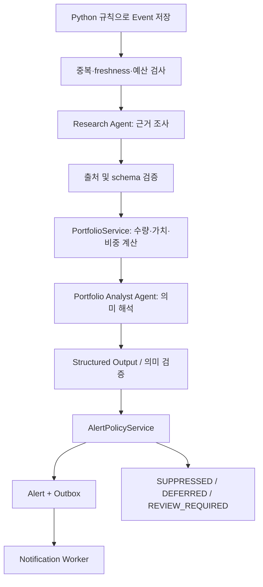

# Agent / Event / RAG 설계
최초 작성: 2026-09-28 · 개정: 2026-09-29 · 설계안

## 1. 실행 그래프

Research와 Portfolio Analyst만 Agent이다. 검증, 계산, 정책, 전송은 일반 코드이다. 후속 질문도 두 Agent를 재사용하며 새 Agent를 만들지 않는다.
내부 workflow 입력에는 event_id, user_id, rule_version, data_cutoff, internal portfolio snapshot, thesis version IDs, workflow/prompt/model version이 포함된다. snapshot은 시점 고정이며 중간 동기화 결과를 섞지 않는다. 이 내부 상태를 LLM에 통째로 전송하지 않는다. 별도 PrivacyFilter가 최소 LLMContext를 만든다.
agent_run 상태는 QUEUED → RUNNING → SUCCEEDED/DEGRADED/FAILED/BUDGET_EXCEEDED이다. 완료 단계 Research 결과를 저장한 뒤 재시도에서 재사용한다. lease가 만료된 실행만 회수하며 늦은 worker 결과는 fencing token으로 거절한다.

## 2. Python 이벤트 규칙
정규장/프리마켓/애프터마켓을 섞지 않는다. 거래소 calendar와 source session을 사용하고 휴일·DST를 반영한다. 규칙은 git YAML로 관리하고 content hash를 event에 저장한다. 아래 수치는 튜닝 전 예시다. 파일 자체는 아직 생성하지 않는다.

```yaml
schema_version: 1
rule_version: "phase1-draft-1"
defaults:
  scope: held_instruments
  session: regular
  stale_after_seconds: 180
  max_events_per_instrument_per_hour: 6
rules:
  - id: price_move
    type: PRICE_MOVE
    enabled: true
    baseline: previous_regular_close
    threshold_abs_pct: 5
    cooldown_seconds: 3600
    rearm_abs_pct: 3
  - id: relative_move
    type: RELATIVE_MOVE
    enabled: true
    benchmark_map: { XNAS: US_BENCHMARK, XNYS: US_BENCHMARK, XKRX: KR_BENCHMARK }
    threshold_abs_percentage_points: 3
    aligned_window_minutes: 60
    cooldown_seconds: 3600
  - id: volume_spike
    type: VOLUME_SPIKE
    enabled: true
    baseline_sessions: 20
    compare: same_elapsed_session_minutes
    min_baseline_sessions: 10
    threshold_ratio: 3
    min_notional_native: { USD: 1000000, KRW: 1000000000 }
    cooldown_seconds: 3600
  - id: new_disclosure
    type: NEW_DISCLOSURE
    enabled: true
    forms: [10_K, 10_Q, 8_K, DART_REPORT]
    include_amendments: true
  - id: important_news
    type: IMPORTANT_NEWS
    enabled: true
    relevance_min: 0.8
    require_verified_instrument: true
    categories: [earnings, guidance, merger, litigation, management]
    dedup_window_hours: 24
  - id: macro_event
    type: MACRO_EVENT
    enabled: true
    series: [FEDFUNDS, CPIAUCSL, UNRATE]
    trigger: new_or_revised_observation
    compare: previous_vintage_same_period
```
benchmark_map의 값은 검증된 instrument_id로 resolve하는 설정 alias이다. 미해결이면 RELATIVE_MOVE를 해당 시장에서 실행하지 않고 운영 오류 표시. 가격 분모 0, 부족한 baseline, 거래정지, 수정주가 혼합은 event 생성 대신 품질 오류다.
IMPORTANT_NEWS는 종목 linkage+공급자 분류/설정 키워드의 결정적 후보 규칙이다. LLM이 모든 기사를 읽어 감시하지 않는다. MACRO_EVENT는 합의 예상치 부재 시 '예상 대비 충격'을 계산하지 않는다.
dedup_key는 user_id+rule_version+type+subject+source_revision 또는 session/window+direction+threshold_band의 hash다. 재실행은 같은 key. cooldown은 최근 event/alert를 DB에서 확인하여 재기동 후에도 유지한다. 중요한 새 공시/정정은 기존 가격 이벤트 cooldown과 독립이다.

## 3. Tool 계약
공통 입력은 instrument_id/범위/시간 기준이고 user_id는 서버 문맥에서만 주입한다. user_id/account_id/계좌 정보는 모델 tool argument나 tool response에 노출하지 않는다. 공통 출력은 data, source_refs[], observed_at, available_at, quality, warnings, retryable이다. source_ref는 공시/뉴스/RAG 근거의 ID, URL, 제목, published_at, fetched_at, locator(문단/page/chunk), content_hash를 가진다. 공개 filing ID와 Broker 주문/체결 ID를 구분하며 후자는 출처 필드로도 모델에 전달하지 않는다.

| Tool | Service | Provider/저장소 | 입력·결과 |
|---|---|---|---|
| get_market_snapshot | MarketService | KIS + market_bar | instrument_id,as_of → 가격·session·수익률·출처 |
| get_company_financials | FinancialService | SEC/OpenDART | instrument_id,period → 값·단위·기간·filing 근거 |
| search_disclosures | DisclosureService | disclosure + provider | instruments,from,to,limit → 공시 references |
| search_news | NewsService | NewsProvider | instruments,from,to,limit → 정규화 기사와 신뢰도 |
| get_macro_snapshot | MacroService | FRED + macro_observation | series[],as_of → observation/vintage |
| search_company_knowledge | KnowledgeService | PG + 선택적 Qdrant | instrument_id,query,types[],as_of,top_k → 정제 chunk·근거 또는 RAG_DISABLED |
| get_portfolio_snapshot | PortfolioService + PrivacyFilter | 내부 계좌 잔고+시세+FX | as_of → 종목별 합산 exposure·비중·영향; 계좌 breakdown 제외 |
| get_investment_thesis | ThesisService | investment_thesis | instrument_id → 버전·사용자 가정 |

Research는 첫 6개, Analyst는 PrivacyFilter를 통과한 합산 ExposureContext와 정제 Thesis 및 필요한 근거 조회만 사용한다. 내부 계좌 snapshot은 Service에만 남긴다. 호출 argument validation, timeout, 크기 상한, 허용 출처 검사를 Tool 경계에서 한다. API가 일시 실패하면 typed NO_DATA/STALE/UNAVAILABLE로 반환한다. 미등록 종목에 무제한 검색을 확장하지 않는다.
Function Tool adapter만 나중에 MCP adapter로 교체할 수 있다. Service와 DTO에는 OpenAI SDK/MCP 타입을 노출하지 않는다.

## 4. Structured Output 계약
OpenAI 공식 문서의 strict JSON Schema 사용을 전제로 한다. 모든 property를 required로 두고 선택 값은 null union, object는 additionalProperties=false로 설계한다. 구조 적합성과 사실 정확성은 다르므로 출처·숫자·품질을 별도 검증한다. [공식 Structured Outputs](https://developers.openai.com/api/docs/guides/structured-outputs)

ResearchResult v1:
| 필드 | 타입 | 규칙 |
|---|---|---|
| schema_version | string | research.v1 |
| event_id | UUID string | 입력과 일치 |
| headline | string | 160자 이하 |
| facts | Fact[] | claim, source_ref_ids[], observed_at; 출처 없는 사실 금지 |
| hypotheses | Hypothesis[] | explanation, supporting_refs[], counter_refs[]; 추정 명시 |
| evidence | SourceRef[] | 서비스가 반환한 실제 ref만 허용 |
| data_gaps | string[] | 빈 RAG/미확인 시세 등 |
| confidence | number | 0..1, 경험적 정확도 확률로 해석하지 않음 |
| summary | string | 2,000자 이하 |

PortfolioAnalysis v1:
| 필드 | 타입 | 규칙 |
|---|---|---|
| schema_version | string | portfolio-analysis.v1 |
| event_id | UUID string | 입력과 일치 |
| importance | integer | 1..5 |
| impact | enum | POSITIVE/NEGATIVE/MIXED/UNKNOWN |
| confidence | number | 0..1 |
| portfolio_impact | object | 아래 정의 |
| alert_required | boolean | 모델의 제안, 최종 발송 지시 아님 |
| summary | string | 사실/해석/불확실성 구분 |
| evidence_ids | string[] | 검증된 refs |
| thesis_assessment | enum | SUPPORTS/CHALLENGES/UNCHANGED/NO_THESIS/UNKNOWN |
| limitations | string[] | 이력/평가/공급자 제한 |

저장/화면용 portfolio_impact는 instrument_id, quantity(decimal string), weight_pct(nullable decimal string), market_value_krw(nullable decimal string), observed_change_krw(nullable decimal string), scenario_change_krw(nullable decimal string), scenario_assumptions(nullable string)을 가진다. macro 이벤트는 affected_positions 배열로 같은 구조를 반복한다. quantity/절대금액은 Service가 내부 계산 후 결과에 주입하며 이 응답 DTO를 모델 입력으로 재사용하지 않는다.
LLM의 strict 중간 출력 ModelPortfolioAnalysis는 importance,impact,confidence,alert_required,summary,evidence_ids,thesis_assessment,limitations와 portfolio_impact={instrument_id,impact_reason,scenario_change_pct(nullable decimal string),scenario_assumptions(nullable string)}를 반환한다. 모든 key required/null union 규칙은 동일하다. Service가 이를 검증하고 계산 필드를 합쳐 최종 portfolio-analysis.v1을 생성한다. 정량 시나리오는 검증된 변화율×내부 평가금액으로 계산하며 미래 확정 손익이나 매매 지시로 표시하지 않는다.

## 5. 정책·알림·후속 대화
제안 정책: importance>=4, confidence>=0.65, 적어도 하나의 검증된 근거, fresh/허용 가능한 partial portfolio, cooldown 통과일 때 발송 후보. 중요 공시이지만 시세가 없으면 시세/손익 숫자 없이 사실 알림은 가능하다. 낮은 confidence의 가격 예측은 보류한다.
LLM alert_required=false이어도 명시적 긴급 공시 규칙은 사실만 알릴 수 있고, true이어도 정책이 거절할 수 있다. reason_code와 policy_version을 alert에 남긴다. D1 A는 확정이다. threshold·quiet hours·빈도 세부 운영값은 잔여 항목 R1로 별도 관리하며 로컬 검증값을 운영 승인값으로 간주하지 않는다.
기본 메시지 형식: 무엇이 발생했는지 → 보유 종목/노출 의미 → 근거 링크 → 기준시각·한계 → Admin 상세 링크. 계좌번호·키·전체 자산 내역을 외부 메시지에 넣지 않는다.
후속 질문은 alert_id로 연결하고 당시 snapshot을 기본 사용한다. '현재' 질문이면 최신 snapshot을 별도 준비하여 변경점을 표시한다. Telegram 답장 webhook/대화 수집은 Phase 1 범위에서 제외하고 Admin 질문 입력으로 확정한다.
Telegram Bot을 사용하며 BOT_TOKEN과 수신 chat_id는 secret/config 참조로 제공한다. 알림 전송 상태 PENDING/SENDING/SENT/RETRY/UNKNOWN/DEAD. 전송 후 응답 유실은 UNKNOWN으로 남긴다. 채널이 idempotency key나 상태 조회를 제공하지 않으면 exactly-once를 보장하지 않는다. 기본안은 UNKNOWN 자동 재전송 대신 Admin 확인 후 재시도다.

## 6. RAG 데이터 흐름
원문은 DocumentStorage를 통한 Object Storage, 메타데이터는 rag_document, 종목 linkage는 rag_document_instrument, vector와 chunk text/payload는 Qdrant다. PG에 chunk 테이블을 복제하지 않는다.
기본 RAG_ENABLED=false: DisabledKnowledgeProvider가 RAG_DISABLED를 즉시 반환하고 client 생성/embedding/Qdrant 연결·색인 enqueue를 모두 생략한다. startup/readiness는 Qdrant에 의존하지 않는다. 활성 RAG 연결은 lazy이며 불가 시 RAG_UNAVAILABLE을 반환하고 workflow는 진행한다.
활성 경로: 등록 → 원문 hash·허용 MIME 검증 → Object Storage 저장 → PG metadata/색인 outbox commit → 추출/정규화·민감정보 검사 → page/heading 기반 chunk → embedding → deterministic point ID upsert → chunk 수와 hash 검증 → PG READY. storage 쓰기 후 DB 실패로 생긴 orphan은 object metadata와 grace period로 대조한 뒤 정리한다.
point ID는 doc_id+version+chunk_index+embedding_version에서 UUID로 결정한다. payload는 visibility(PUBLIC/PRIVATE), user_id(PRIVATE 소유자 UUID, PUBLIC은 null), doc_id, doc_version, instrument_ids[], ticker_aliases[], document_type,title,source,source_url,published_at,fiscal_year,quarter,language,chunk_index,locator,text,content_hash,embedding_version을 포함한다.
공통 기업 문서는 visibility=PUBLIC/user_id=null, 개인 Thesis/Note는 visibility=PRIVATE/user_id=app_user.id다. 모든 검색에 (PUBLIC OR PRIVATE+현재 user_id) 및 instrument_id filter를 서버가 주입한다. 모델이 filter를 제거하거나 타 사용자 ID를 지정할 수 없다. ticker는 먼저 내부 ID로 resolve하고 모호하면 오류 반환한다.
추천 chunk는 600~1,000 token, overlap 100~150, top_k=6. 이 값은 임베딩 모델·문서별 실험 대상이다. embedding model/version/dimension을 collection별 고정하며 변경 시 별도 collection 재색인·전환한다.
Qdrant 반환 chunk는 PG의 status=READY/version/deleted_at와 다시 비교하여 아직 공개되지 않은 새 버전이나 삭제 chunk를 제외한다. PostgreSQL/Qdrant 간 분산 트랜잭션은 없으므로 outbox로 재시도하고 FAILED/INDEXING orphan을 주기적으로 수선한다.
RAG_DISABLED(설정 꺼짐), RAG_NO_MATCH(검색 성공/결과 없음), RAG_UNAVAILABLE(활성 의존성 장애)을 구별하되 모두 workflow 실패 원인이 아니다. 공시/뉴스/시장 Tool로 진행하고 data_gaps에 기록한다.
10_K/10_Q/DART_REPORT/IR/EARNINGS/EARNINGS_CALL/INDUSTRY_REPORT/INVESTMENT_THESIS/USER_NOTE는 메타 타입으로 지원한다. 모든 타입의 자동 수집기·유료 원문 계약을 Phase 1 필수로 만들지 않는다. 권리 있는 업로드와 DART/SEC를 먼저 사용한다.
원문은 Object Storage에 보관 가능한 구조로 확정하며 공급자 선정과 실제 보존 기간은 R3에서 관리한다. API/Worker의 임시 filesystem을 원문 Source of Truth로 사용하지 않는다. 암호화·source URL·content hash·삭제 정책은 DB_DESIGN 참조.
비활성 중 신규 업로드/재색인은 409 RAG_DISABLED이며 Thesis 자체 저장은 계속된다. 기존 RAG 작업은 outbox DEFERRED로 대기하고 retry count를 늘리지 않는다. 재활성화 시 해당 문서의 tombstone/현재 version을 확인하여 유효한 작업만 재개한다. 삭제 요청은 즉시 tombstone 처리하고 실제 vector/object 삭제는 의존성 복구 뒤 완료한다. 설정 off는 데이터 삭제 명령이 아니다.
외부 embedding에도 LLM과 동일한 비밀 금지 정책을 적용한다. 업로드에 계좌번호·주문/체결 ID·raw Broker 자료가 발견되면 외부 전송 전에 정제하고, 안전한 정제를 보장할 수 없으면 문서 색인을 실패/보류 처리한다.

## 7. 제어·복구·평가
제안 상한: 실행당 Tool 12회, Agent별 LLM 시도 2회, 전체 120초, 일일 token/금액 예산 설정. quota 초과 시 BUDGET_EXCEEDED로 기록하며 이벤트 수집은 계속한다. 공급자 추상화와 비용 통제 방향은 D5 A 확정이며 구체 모델·비용 한도는 R2에서 실제 유료 호출 전에 정한다.
외부 문서·뉴스·RAG 내용은 데이터이며 명령으로 따르지 않는다. 임의 tool name/URL/파일 실행 요청을 차단한다. 계좌 식별값은 LLM 입력 전에 제거한다.
필수 평가 fixture: 출처 없는 주장, 같은 ticker 다른 시장, 수정 공시, 없는 Thesis/RAG, FX 결측, 오래된 잔고, split로 인한 가격 변화, 동일 기사 반복, macro와 단일종목의 과도한 인과 추론. 지표는 근거 유효율·숫자 일치율·중복 알림률·false positive·비용·지연이다.
모델 refusal/incomplete/schema 오류는 typed failure로 기록하고 제한된 재시도 후 종료한다. 누락값을 모델이 채워 만든 숫자로 대체하지 않는다.

## 8. 외부 LLM 데이터 최소화
LLMContext allowlist는 instrument_id/symbol, 합산 보유 여부·증권 내 비중·exposure 방향, 기준시각/freshness, 필요한 공개 시장 근거, 관련 Thesis의 정제된 최소 발췌다. Research에는 개인 Portfolio를 전달하지 않는다. Analyst에는 계좌를 합산한 문맥만 제공한다.
정확한 보유 수량·원화 절대금액은 기본 외부 입력에서 제외하고 서버가 최종 결과에 결합한다. 기본 분석은 비중/변화율로 수행한다. 새로운 분석 기능이 절대정보를 요구하면 DTO 정책 검토를 거쳐 필요한 필드만 추가하며 전체 snapshot으로 대체하지 않는다.
차단 목록: Broker 계좌번호·accountSeq·account_id·account_key·masked_account·credential·token·주문/체결 ID(내부 및 외부)·raw Broker response·개인 user_id·계좌별 breakdown. token을 담을 수 있는 URL/header/trace도 검사한다.
사용자 후속 질문, Thesis, RAG 발췌에도 동일한 PrivacyFilter를 적용한다. 자동 정제 불확실 시 외부 호출을 중단하고 PRIVATE_INPUT_BLOCKED로 기록한다. 금지 데이터가 최종 모델 request/도구 결과/trace에 없는지 합성 sentinel fixture로 검증한다.
내부 agent_run.input_snapshot은 재현용 접근 제한 자료이며 외부 입력과 다르다. 별도 원 프롬프트 중복 저장 대신 llm_context_hash,privacy_policy_version,model/token/출처 메타를 남긴다.

## 9. LLM 저장 최소화 정책
Responses 호출은 store=false를 명시하고 외부 Conversations/Files/호스팅 vector store에 개인 분석 이력을 보관하지 않는다. 대화 상태는 내부 PostgreSQL에서 최소 필요 문맥만 재구성한다. Celery의 백그라운드 작업과 LLM 공급자의 background mode는 별개이며 후자는 사용하지 않는다. 확장 prompt caching도 기본 비활성이다.
store=false는 애플리케이션 응답 보관을 줄이는 요청이지 모든 보존의 제거 또는 Zero Data Retention 활성화를 뜻하지 않는다. abuse monitoring 및 모델/기능별 예외가 있고 ZDR/MAM은 계정 적격성·승인 확인이 필요하다. 실제 선택 endpoint/model의 최신 정책을 유료 사용 전에 재검증한다. [OpenAI 공식 Data controls](https://developers.openai.com/api/docs/guides/your-data) (확인 2026-09-29).
내부 snapshot/대화/원문 보존 기간은 외부 API의 store 옵션과 독립이며 R3에서 확정한다. HTTP 요청/응답 body 및 prompt를 일반 운영 로그에 남기지 않는다.

## 10. Telegram 전달 계약
NotificationProvider.send(alert_id,recipient_ref,rendered_message)는 Telegram Bot sendMessage adapter로 연결한다. chat_id는 서버 설정에서 resolve하며 모델이 수신자를 지정할 수 없다. 성공 Message의 message_id를 저장하고 429의 retry_after를 따른다. 설명·출처·상세 링크를 메시지 길이 제한 안에서 요약하며 원문이나 개인 상세자료를 분할하여 대량 전송하지 않는다. [Telegram Bot API](https://core.telegram.org/bots/api#sendmessage)
Bot token이 URL 경로에 들어갈 수 있으므로 outbound URL과 HTTP 예외도 redaction한다. 전송 timeout의 UNKNOWN은 자동 재발송하지 않고 운영자 재시도만 허용한다. 재시도 요청의 HTTP 멱등성과 Telegram 서버의 전송 중복 가능성은 구별한다.
로컬에서는 이미 시작한 Bot 채팅의 수신 설정을 검증하고 test double로 전송 로직을 먼저 테스트한다. 실제 발송/실제 개인정보는 이번 설계 작업에서 전혀 사용하지 않는다. 로컬 Admin URL은 다른 기기에서 접근 가능하다고 가정하지 않고 모바일 외부 공개를 위해 임의 터널을 추가하지 않는다.
