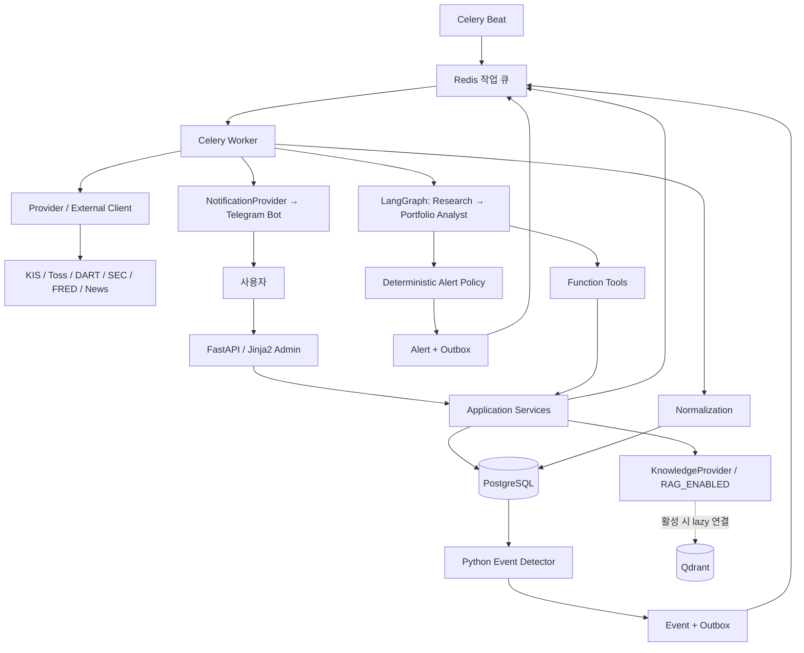

# 시스템 Architecture
최초 작성: 2026-09-28 · 개정: 2026-09-29 · 설계안 · D1/D2/D4/D5/D6 확정 · D7 방향 확정 · D3 Deferred

## 1. 구조
D:\workspace\portfolio-manager의 모듈형 모놀리스 코드베이스를 API, Worker, Scheduler 프로세스로 구분하고 Local Docker에서 우선 완성한다. Railway 운영 플랜과 출구 IP 선택은 배포 시점으로 보류한다. 금융 도메인·공급자 변환·Agent 입출력의 경계를 유지하되 Phase 1에 마이크로서비스를 추가하지 않는다.

LLM은 네트워크 클라이언트·DB·Broker secret에 직접 접근하지 않는다. 내부 PortfolioSnapshot과 외부 LLMContext를 분리하며 PrivacyFilter가 허용 필드만 새 DTO로 구성한다. Tool → Service → Provider 순서이며 수집 및 Tool 조회 모두 같은 Service를 재사용한다.

## 2. 경계와 책임
| 모듈 | 책임 | 금지 |
|---|---|---|
| domain | Instrument, money, position, event 의미·불변조건 | FastAPI/외부 응답 타입 의존 |
| providers | 인증·timeout·rate limit·pagination·vendor 오류 변환 | 통합 잔고 계산, 알림 판단 |
| normalization | 외부 식별자 매핑, decimal/시간/통화 정규화 | symbol 단독 동일종목 추정 |
| services | 동기화·평가·정합성·검색·알림 트랜잭션 | LLM 프롬프트에 금융 계산 위임 |
| tools | 입력 검증·권한 문맥·Service 호출·출처 envelope | 개별 API 클라이언트 구현 |
| agents | 근거 조사와 포트폴리오 의미 설명 | 잔고 수정, 주문, 알림 직접 발송 |
| jobs | 예약·재시도·lease·회복·outbox dispatcher | 큐가 exactly-once라는 가정 |
| web | Admin와 API DTO | Broker secret·원계좌번호 노출 |

권고 Python stack은 사용자 후보 그대로 유지한다. 구현 시 Python 및 라이브러리 상호 호환 버전을 lock한다. 현재 버전 번호를 근거 없이 고정하지 않는다.

## 3. 공식 Broker 조사
확인 기준일 2026-09-28. 아래는 문서로 확인한 기능이며 사용자 계좌의 사용 자격·키·상품 범위·실제 응답을 검증한 것은 아니다.

| 항목 | KIS | Toss |
|---|---|---|
| 계좌 발견 | 예제는 CANO/ACNT_PRDT_CD 사전 설정. 모든 계좌 자동 열거를 가정하지 않음 | GET /api/v1/accounts, accountSeq를 계좌 헤더로 사용 |
| 국내 잔고 | /uapi/domestic-stock/v1/trading/inquire-balance | GET /api/v1/holdings |
| 해외 잔고 | /uapi/overseas-stock/v1/trading/inquire-balance, 시장/통화별 조회 | 동일 holdings가 KR/US 주식 반환 |
| 국내 주문체결 | /uapi/domestic-stock/v1/trading/inquire-daily-ccld | GET /api/v1/orders 및 /api/v1/orders/{orderId} |
| 해외 주문체결 | /uapi/overseas-stock/v1/trading/inquire-ccnl | 동일 orders |
| pagination | 응답 연속조회 header + CTX_AREA 키, TR·환경별 규칙 | CLOSED: cursor/hasNext. OPEN: 전량 반환, cursor/limit 무시 |
| 시간 | 해외 주문 조회 날짜는 현지 날짜로 문서화됨. 필드별 기준 확인 | orders from/to는 orderedAt의 KST 날짜, filledAt은 최종 체결 KST |
| 체결 단위 | endpoint별 주문 집계/개별 구분을 확인하여 capability 설정 | OrderExecution은 누적 수량·평균가·최종 체결시간. 개별 execution ID 없음 |
| 제한 | 실전/모의·과거 조회 구간·시장별 차이, 완전 역사 보장 안 함 | 주문 조회는 지원 호가 유형 한정. 계좌 목록은 현재 BROKERAGE만, 자녀계좌 미지원 |

KIS 근거: [공식 저장소](https://github.com/koreainvestment/open-trading-api), [국내 잔고](https://raw.githubusercontent.com/koreainvestment/open-trading-api/main/examples_llm/domestic_stock/inquire_balance/inquire_balance.py), [해외 잔고](https://raw.githubusercontent.com/koreainvestment/open-trading-api/main/examples_llm/overseas_stock/inquire_balance/inquire_balance.py), [국내 일별 주문체결](https://github.com/koreainvestment/open-trading-api/blob/main/examples_llm/domestic_stock/inquire_daily_ccld/inquire_daily_ccld.py), [해외 주문체결](https://raw.githubusercontent.com/koreainvestment/open-trading-api/main/examples_llm/overseas_stock/inquire_ccnl/inquire_ccnl.py).
Toss 근거: [공식 가이드](https://developers.tossinvest.com/), [공개 OpenAPI JSON](https://openapi.tossinvest.com/openapi-docs/latest/openapi.json). 직접 읽은 명세 info.version=1.2.19, SHA-256=7588DEBD863AC074E9E408185413AB573C3D45E9221E8CEDAEEC7C54EE295F03. 검색 색인의 이전 버전보다 원문 명세를 우선했다.

Toss의 API 인증은 client credentials이며 사용자 로그인 구현이 아니다. D2의 Secret 기반 Single Admin 인증은 app_user에 대응하는 Principal을 만들고 금융 서비스에는 user_id를 전달한다. 공개 가이드는 허용 IP 등록을 설명한다. 로컬 실연동 시 실제 계정의 IP 요건을 먼저 검증한다. Railway Hobby/Pro/Static Outbound IP는 D3 Deferred이며 로컬 개발의 선행 구매 조건이 아니다. Static Outbound IP가 필수임이 확인되는 시점에 인프라 정책을 결정한다. 주문 생성 API가 명세에 존재해도 클라이언트 allowlist에 포함하지 않는다. 토큰 발급 POST만 조회 인증 목적의 예외다.

## 4. Provider 계약 제안
아래는 인터페이스 설계이며 실행 코드가 아니다.

| 계약 | 입력 | 출력·의미 |
|---|---|---|
| capabilities | connection_ref | markets, account_discovery, execution_granularity, history_coverage, quantity_basis, supported_assets |
| get_accounts | connection_ref | AccountDescriptor[], discovery=REMOTE/CONFIGURED |
| get_holdings | account_ref, scope, cursor? | HoldingsPage(items, next_cursor, observed_at, broker_as_of?, scope, complete, quantity_basis) |
| get_orders | account_ref, market, date_window, status_group, cursor? | OrderPage, coverage, source timezone |
| get_executions | account_ref, window, cursor? | ExecutionPage(granularity=FILL/ORDER_AGGREGATE/UNSUPPORTED), coverage |
| sync_portfolio | Service 계약: account_id, requested_scopes, request_key | sync_run_id |

sync_portfolio는 Provider에 두지 않는다. BrokerSyncService가 Provider를 조합하고 DB 원자성·정합성을 책임진다. Toss get_executions는 같은 주문 조회 결과에서 정규화하며 중복 외부 요청을 피한다. ORDER_AGGREGATE를 개별 fill로 가장하지 않는다.
일반 오류는 AUTH_EXPIRED, FORBIDDEN, RATE_LIMITED(retry_after), TRANSIENT, UNSUPPORTED, INVALID_RESPONSE, INCOMPLETE_PAGE로 변환한다. 빈 결과와 오류를 구별한다.

## 5. 동기화와 장애
1. 계좌+scope의 DB lease를 획득하고 sync_run 생성. 자동/수동 중복 실행은 기존 실행 ID 반환.
2. 모든 페이지를 임시 메모리/제한된 scratch에 수집. 개수·scope·시간 기준·mapping 검증. token/cursor/raw 원문은 로그에 남기지 않는다.
3. 계좌 scope lock 아래 신규 snapshot이 과거 실행보다 최신인지 확인. 거래 upsert, 완전한 잔고 snapshot, sync 상태를 하나의 DB transaction으로 반영.
4. Position에서 없어진 종목은 해당 scope의 완전한 성공 snapshot일 때만 0으로 갱신. 부분조회·인증오류·mapping 실패는 기존 잔고 유지.
5. 이력과 Broker 잔고의 기준이 맞을 때 reconciliation. mismatch는 잔고 덮어쓰기나 허위 체결 삽입으로 해결하지 않는다.
6. 변경된 portfolio를 이용할 이벤트·후속 처리 outbox를 동일 transaction에서 기록.

국내/미국 scope는 독립 sync_run으로 처리하여 한 시장 장애가 다른 시장 성공을 막지 않는다. 계좌별/시장별 관측시각은 다를 수 있다. 통합 Portfolio는 각 기준시각과 stale 상태를 공개한다.
Toss OPEN 주문은 생성일 필터 없이 조회하여 오래전에 접수된 미결 주문을 놓치지 않는다. CLOSED는 overlap 날짜 범위를 재조회하고, 이전에 OPEN이었던 주문은 CLOSED 목록에서 빠져도 주문 상세로 최종 상태를 확인한다. KIS도 조회 가능 범위 안에서 overlap과 미결 주문 추적을 병행한다. watermark는 완전한 페이지 수집 후에만 전진한다.
Redis lock만으로 데이터 정합성을 보장하지 않는다. 중복 worker는 DB unique key + lease token 검사 + 트랜잭션으로 제어한다. sweep 작업이 만료 lease와 pending outbox를 재처리한다.

## 6. 종목 정규화
instrument_id는 내부 UUID. symbol, 거래소 MIC, asset_type, currency는 식별 단서이지 영구 PK가 아니다. Broker 코드와 거래소 코드 조합은 broker_instrument_map을 거친다.
KIS NASD 같은 vendor 시장코드를 내부 MIC와 무조건 1:1 매핑하지 않는다. Toss의 marketCountry만으로 거래소가 확정되지 않으면 종목 master를 추가 조회하거나 미매핑으로 격리한다. symbol 재사용·상장 이전은 validity 기간으로 처리한다.
공시 기업 식별 CIK/corp_code는 기업 단위이므로 여러 share class가 같은 값을 가질 수 있다. 공시와 instrument는 연결표를 사용한다.

## 7. 데이터 서비스
| Provider | 수집·정규화 | 주의 |
|---|---|---|
| KIS MarketProvider | 종목별 bars/quote, native currency, session | 수정/비수정 가격 및 정규장 분리 |
| OpenDartProvider | 기업코드·공시 접수번호·재무 기간 | 날짜만 있으면 시간 정밀도 DAY |
| SecProvider | CIK, accession, 제출시각, companyfacts | 재무 unit·기간·정정 filing 보존 |
| FredProvider | series·observation_date·vintage·unit | 결측 '.', 개정치, 기준기간 ≠ 발표시각 |
| NewsProvider | source ID·URL·발행시각·종목 linkage | 언어·KR/US 커버리지 및 저장 권리 검토 |
| FxProvider | USD/KRW 기준시각·가격·출처 | D5 A 확정, 구체 공급자 검증·예산은 운영 전 선정. FRED를 실시간 FX로 간주하지 않음 |

근거: [OpenDART 공시 가이드](https://opendart.fss.or.kr/guide/main.do?apiGrpCd=DS001), [SEC EDGAR API](https://www.sec.gov/search-filings/edgar-application-programming-interfaces), [FRED API](https://fred.stlouisfed.org/docs/api/fred/), [Marketaux 문서](https://www.marketaux.com/documentation).
MarketauxNewsProvider는 후보이며 확정 의존성이 아니다. 조회·정규화 계약은 search(instrument_ids, since, cursor) → NewsPage로 공통화한다. 저장·임베딩 가능한 텍스트만 수집한다.

## 8. 지속 작업과 데이터 신뢰
PostgreSQL이 작업 결과·재처리 의도의 원장이다. Redis는 queue/cache로 손실되어도 pending event/outbox/sync_run 상태로 복구한다. Celery는 중복 전달을 전제로 한다. [Celery Tasks](https://docs.celeryq.dev/en/stable/userguide/tasks.html)
PUBLISHED는 Redis enqueue 확인이지 작업 완료가 아니다. dispatcher sweep은 대상 aggregate의 완료 상태와 lease를 검사하고, 제한 시간 동안 미완료인 PUBLISHED를 다시 발행한다. 이미 완료된 consumer는 동일 대상의 중복 메시지를 무효 처리한다. 알림 UNKNOWN은 이 일반 재발행으로 재전송하지 않는다.
외부 call 중 DB transaction을 열어두지 않는다. 각 단계 입력 snapshot과 완료 결과를 agent_run에 저장하며 LangGraph는 유한한 두 Agent 흐름을 표현한다. Phase 1에는 별도 LangGraph checkpoint DB 테이블을 병행하지 않고 완료 단계부터 Service가 재구성한다. [LangGraph persistence](https://docs.langchain.com/oss/python/langgraph/persistence)

## 9. 사용자 도메인과 실행 문맥
최소 app_user(id UUID, display_name, status, created_at, updated_at)를 둔다. 이메일/전화/SNS subject/비밀번호를 사용자 PK로 사용하지 않는다. SingleAdminAuthenticator가 배포 설정의 ADMIN_USER_ID를 기존 ACTIVE app_user에 매핑하고 Principal.user_id를 생성한다. 최초 초기화 후 동일 UUID를 유지하며 인증 secret 회전은 금융 데이터 소유권을 바꾸지 않는다.
broker_account, event, agent_run, alert, investment_thesis, conversation_message, idempotency_request는 user_id FK를 갖는다. 하위 금융 행은 계좌를 통해 소유권을 상속한다. 공용 데이터와 개인 RAG는 visibility와 nullable user_id로 분리한다. private 행에 NULL을 허용하지 않는다.
모든 서비스는 UserContext를 받아 소유권을 검증한다. Job은 서버가 검증한 대상 행에서 사용자 문맥을 복원하며 client/model이 전달한 user_id를 신뢰하지 않는다. 미래 Kakao/Naver/Google 로그인은 별도 external identity 연결을 추가하여 기존 app_user.id를 그대로 사용한다. 현재 가입·OAuth callback·RBAC·SNS 연결 테이블/서비스는 구현하지 않는다.

## 10. HTTP 멱등성과 비동기 전달 분리
idempotency_request는 (user_id, operation, idempotency_key)별 body hash와 안정된 응답 참조를 저장한다. outbox_message는 event_key별 도메인 작업 payload와 publish 상태만 관리한다.
변경 API의 단일 PG transaction은 idempotency_request 예약 → 금융/작업 행 변경 → 필요한 경우 outbox 생성 → 재생 가능한 응답 저장 → commit 순서다. 예약만 IN_PROGRESS로 commit하지 않는다. 외부 API 호출은 이 transaction 밖의 Worker에서 수행한다.
동일 HTTP 요청이 재전송되면 응답을 재생하고 outbox를 추가 생성하지 않는다. Scheduler가 만든 event는 HTTP 요청 기록 없이 outbox를 생성한다. outbox 재발행은 HTTP 응답 상태를 변경하지 않는다. 금융 이력의 U4 unique는 두 메커니즘과 독립된 마지막 중복 방지 장치다.

## 11. 선택적 RAG와 Object Storage
KnowledgeService는 DisabledKnowledgeProvider와 QdrantKnowledgeProvider를 교체한다. 기본 RAG_ENABLED=false이면 Qdrant client/embedding client 생성, 연결 확인, collection 생성, 색인 enqueue를 하지 않는다. API/Worker startup 및 readiness는 Qdrant에 의존하지 않는다.
활성화된 RAG도 lazy initialization·timeout·circuit breaker로 격리하며 장애 시 RAG_UNAVAILABLE로 반환하고 비RAG 분석을 지속한다. RAG_DISABLED / RAG_NO_MATCH / RAG_UNAVAILABLE은 서로 다른 상태다.
DocumentStorage interface는 put/get/delete/head와 opaque object key를 제공한다. 원문은 Object Storage, metadata는 PostgreSQL, vector/chunk는 Qdrant로 고정한다. 공급자 endpoint/bucket/credential은 설정으로 분리하고 로컬에서는 호환 서버 또는 test double로 검증한다. 기본 비활성 모드에서는 Object Storage도 startup 필수 dependency가 아니다.
