# Logical / Physical DB 설계
최초 작성: 2026-09-28 · STEP 1 개정: 2026-09-29 · STEP 2 범위 반영: 2026-10-05 · 전체 논리 모델 유지

## 1. 설계 원칙과 데이터 권위
### STEP 2 물리 구현 경계 — 2026-10-05
전체 26개 논리 테이블과 아래 사전은 장기 기준으로 유지한다. Initial Migration은 다음 **11개**만 생성한다.
app_user, broker_account, instrument, broker_instrument_map, account_position, trade_execution,
position_adjustment, sync_run, reconciliation_result, idempotency_request, outbox_message.
Alembic 자체 이력 테이블은 업무 테이블 수에 포함하지 않는다. 나머지는 실제 기능을 개발하는 후속 STEP의 새 Migration으로 추가한다.

**DESIGN ISSUE STEP2-DB-01**
- 현재 설계: trade_execution.order_id는 broker_order.id를 참조하는 nullable FK다.
- 문제: 사용자 지정 Initial Migration 목록에 broker_order가 없어 해당 FK를 생성할 수 없다.
- 단계별 해법: STEP 2에서는 order_id 컬럼과 FK를 함께 보류하고, 주문 모델 도입 시 새 Migration에서 함께 추가한다. FK 없는 임시 UUID 컬럼이나 추가 테이블로 범위를 늘리지 않는다.
- 영향: 이번 물리 모델에는 order_id가 없지만 전체 논리 사전은 보존한다. 주문 기반 FILL/ORDER_AGGREGATE 전환 검증은 후속 Service 범위이며 실제 Broker 수집/체결 입력은 이번 단계에 제공하지 않는다.

현재 PositionRepository는 user_id 소유권, instrument 통화, sync_run 계좌/scope를 검사한다.
아직 write Service가 없는 체결/조정/대사의 교차 행 불변조건은 해당 기능 구현 시 적용한다.
기본 수량/상태/unique/FK는 DB 제약, numeric(28,10)의 무손실 입력과 timezone-aware datetime은 ORM bind에서 검증한다.
Map 유효기간은 btree_gist 배제 제약으로 중첩을 금지한다. Migration 이력은 모델 metadata를 실행 시 import하지 않는 독립된 revision으로 고정한다.

### Phase 1 전체 설계 원칙
이 문서는 실제 DDL이 아니라 논리 모델과 PostgreSQL 타입·키·제약·인덱스의 물리 설계안이다. D4/D6 확정과 D7 방향 확정을 반영한다. D3 운영 인프라는 Deferred이며 공급자·보존 기간의 남은 운영 결정은 [DECISIONS](DECISIONS.md)에 구분한다.
instrument는 종목 정체성, account_position은 계좌별 관측 보유 상태, trade_execution은 조회 가능한 체결 이력이다. 체결로 계산한 잔고와 관측 잔고를 하나의 컬럼에 덮어쓰지 않는다.
BROKER_API 계좌의 현재 보유 Source of Truth는 Broker의 완전한 holdings snapshot이다. PostgreSQL은 이를 관측한 시점의 내부 기준이다. MANUAL 계좌는 승인된 기초잔고+수동 거래+조정이 원장이며 account_position은 재계산 가능한 projection이다.
ticker는 영구 PK가 아니다. 모든 금융 참조는 instrument.id UUID를 사용한다. 종목 통합은 같은 instrument_id에 대해서만 한다.
최소 app_user 테이블을 두어 데이터 소유권과 인증 방식을 분리한다. 개인 데이터 root의 user_id는 app_user.id UUID FK이며 상수 기본값이 없다. 하위 금융 행은 account/event/alert를 통해 소유권을 따른다. Phase 1은 bootstrap된 app_user 한 명을 Secret 인증의 Principal에 매핑하되 DB에 사용자 수 1개 제약을 두지 않는다. 향후 SNS 인증 identity는 별도 연결표를 추가하며 기존 금융 FK는 변경하지 않는다. 이 최소 모델이 완성된 Multi User 인증/권한 구현을 뜻하지 않는다.

## 2. 공통 타입·시간·보안
모든 테이블은 id UUID PK(애플리케이션 UUID 생성)와 created_at timestamptz NOT NULL(현재 UTC)을 실제 컬럼으로 가진다. 아래 사전에도 테이블마다 명시한다.
numeric(28,10)은 수량·가격·금액·환율에 사용한다. float/double을 사용하지 않는다. API는 decimal string. PostgreSQL storage scale보다 정밀한 원값은 silent rounding하지 않고 검증/격리한다.
timestamp는 timestamptz, DB session UTC. UI는 Asia/Seoul 표시. 시장 calendar는 IANA America/New_York/Asia/Seoul 등을 사용한다. 고정 UTC-5 같은 방식은 DST에 부적합하다.
trade_date는 Provider가 정의하는 거래/조회 날짜이고 UTC 날짜와 다를 수 있다. KIS 해외 주문 날짜와 Toss KST 주문 날짜를 동일 규칙으로 변환하지 않는다. 날짜만 있는 데이터는 published_date/time_precision=DAY와 published_at=NULL로 표현한다. 임의 자정은 사실 시각으로 저장하지 않는다.
원 통화 avg_cost/price를 저장하며 조회·평가시에만 FX로 변환한다. 통화 미확인 시 KRW를 기본값으로 강제하지 않는다. Broker 평가 총액은 혼합 환율/수수료 기준일 수 있어 독립 합산 근거로 쓰지 않는다.
민감 계좌 식별값은 가능하면 secret에 보관하고 DB는 credential_ref/masked_account/keyed HMAC만 둔다. 필요한 vendor accountSeq는 인증 암호화(AEAD)한 ciphertext로 보관하며 envelope에 key version/nonce를 포함한다. 암호화 key는 로컬 Docker secret, 향후 Railway Secret, 회전 시 account_key의 중복 방지 유지 절차 필요.
API key/secret/token은 DB 평문 금지. Provider raw response 전체 저장은 기본 비활성화. 증빙은 비식별 normalized 값·source hash만 저장한다. token·원계좌번호·개인 논지는 로그에 남기지 않는다. 내부 재현 snapshot과 외부 LLM 입력을 구분한다. 계좌번호·credential·token·주문/체결 ID·raw Broker response는 LLM 입력 및 외부 embedding에서 제외하며 계좌별 breakdown 대신 합산 exposure만 사용한다.

## 3. ERD
아래는 관계 중심 ERD다. 모든 실제 컬럼은 5절에서 정의한다. outbox의 다형 aggregate_id는 FK를 가장하지 않으며 코드에서 대상 존재를 검증한다.

```mermaid
erDiagram
  app_user ||--o{ broker_account : owns
  app_user ||--o{ event : monitors
  app_user ||--o{ agent_run : requests
  app_user ||--o{ alert : receives
  app_user ||--o{ investment_thesis : authors
  app_user ||--o{ conversation_message : owns
  app_user ||--o{ idempotency_request : retries
  app_user o|--o{ rag_document : private_owner
  app_user o|--o{ outbox_message : context
  broker_account ||--o{ broker_order : owns
  broker_account ||--o{ trade_execution : records
  broker_account ||--o{ position_adjustment : anchors
  broker_account ||--o{ account_position : holds
  broker_account o|--o{ sync_run : syncs
  broker_account ||--o{ reconciliation_result : compares
  instrument ||--o{ broker_instrument_map : maps
  instrument ||--o{ broker_order : ordered
  instrument ||--o{ trade_execution : traded
  instrument ||--o{ position_adjustment : adjusted
  instrument ||--o{ account_position : held
  instrument ||--o{ reconciliation_result : reconciled
  broker_order o|--o{ trade_execution : contains
  sync_run ||--o{ broker_order : observes
  sync_run o|--o{ trade_execution : imports
  sync_run o|--o{ account_position : publishes
  sync_run ||--o{ reconciliation_result : checks
  instrument ||--o{ market_bar : priced
  news_article ||--o{ news_instrument : links
  instrument ||--o{ news_instrument : mentioned
  disclosure ||--o{ disclosure_instrument : links
  instrument ||--o{ disclosure_instrument : covered
  disclosure o|--o{ disclosure : amends
  instrument o|--o{ event : triggers
  event ||--o{ agent_run : analyzed
  event ||--o{ alert : causes
  agent_run ||--o{ alert : decides
  instrument ||--o{ investment_thesis : explains
  investment_thesis o|--o{ investment_thesis : revises
  investment_thesis o|--o{ rag_document : indexed
  rag_document ||--o{ rag_document_instrument : links
  instrument ||--o{ rag_document_instrument : searchable
  alert ||--o{ conversation_message : discusses
  agent_run o|--o{ conversation_message : responds
  app_user {
    uuid id PK
  }
  idempotency_request {
    uuid id PK
  }
  broker_account {
    uuid id PK
  }
  instrument {
    uuid id PK
  }
  fx_rate {
    uuid id PK
  }
  macro_observation {
    uuid id PK
  }
  outbox_message {
    uuid id PK
  }
```

## 4. Table Dictionary
Source of Truth는 용도별로 구분한다. 예를 들어 Agent 결과는 해석 기록의 원장이지만 금융 사실의 원장은 아니다.

| Table | 역할 | Source of Truth | 생성 주체 | 수정 시점 | 관련 API |
|---|---|---|---|---|---|
| app_user | 인증과 독립된 내부 사용자 식별 | 데이터 소유권의 기준 | 명시적 bootstrap 관리 절차 | 표시명/활성 상태 변경 | 인증 Principal의 내부 참조; 가입 API 없음 |
| idempotency_request | HTTP 업무 변경 재요청과 응답 재생 | HTTP 멱등성 원장 | API CommandService | 단일 transaction 내 예약 및 응답 완료 | Idempotency-Key를 받는 변경 API |
| broker_account | 계좌와 잔고 출처 경계 | 계좌 설정의 원장; 잔고 원장 아님 | 운영자 설정/BrokerSyncService | 설정 변경·연결 확인 | /accounts, /brokers |
| instrument | 보유와 무관한 상장 종목 정체성 | 검증된 종목 master의 내부 기준 | InstrumentService | 명칭·상장정보 변경, ID 유지 | /instruments |
| broker_instrument_map | Broker 종목코드와 내부 종목 매핑 | 정규화 기준 | InstrumentService | 검증된 매핑 생성·유효기간 종료 | /instruments 및 sync |
| broker_order | 읽기 전용 주문 상태와 체결 범위 | Broker 주문의 최신 관측 projection | BrokerSyncService | 조회 시 상태·누적 값 갱신 | /orders |
| trade_execution | 실제 체결/주문별 체결 집계와 수동 거래 | 관측된 이력 원장; 완전한 거래 원장 보장 아님 | BrokerSyncService/ManualService | 동일 identity 재관측·정정은 revision 증가 | /executions, /manual-transactions |
| position_adjustment | 기초잔고·비거래 수량조정 | 사용자가 승인한 재구성 기준 | ManualService | 생성 후 불변, 잘못된 행은 void 후 대체 | /opening-balances, /position-adjustments |
| account_position | 계좌·scope·종목의 최신 관측 잔고 | Broker 계좌는 Broker 관측의 기준; 수동은 재구성 projection | SyncService/ManualService | 완전한 scope snapshot 성공 시 교체 | /accounts/{id}/positions, /portfolio |
| sync_run | 동기화·수집 작업 실행 및 coverage | 작업과 잔고 snapshot 적용 이력의 원장 | JobService | 상태 전이·lease 갱신·완료 | /sync-runs/{id} |
| reconciliation_result | 계산 수량과 관측 수량 비교 | 판정 결과의 감사 원장 | ReconciliationService | 완료 결과 불변, 해결 메모만 갱신 | /reconciliations |
| market_bar | 시장 시세와 이벤트 기준값 | Provider 관측 데이터, 수정 가능 | MarketService | 늦은 bar/정정 수신 시 갱신 | 시장 Tool |
| fx_rate | 평가시점 환율 | 선정된 FX 공급자 관측 | FxService | 새 기준시각 저장·동일시각 정정 | /portfolio 및 Tool |
| news_article | 정규화 뉴스·출처·중복 기준 | 공급자 관측 메타 | NewsService | 새 기사 및 내용 정정 | 뉴스 Tool |
| news_instrument | 기사와 여러 종목의 관계 | 검증된 relevance 연결 | NewsService | entity 매핑 개선 | 뉴스 Tool |
| disclosure | 회사 공시 메타와 정정 관계 | 공식 공시 관측 | DisclosureService | 신규 접수·정정 공시 추가 | 공시 Tool |
| disclosure_instrument | 기업 공시와 여러 상장종목 연결 | 검증된 종목 관계 | DisclosureService | 종목 master 매핑 시 | 공시 Tool |
| macro_observation | 거시 관측치와 개정 시점 | FRED 등 관측 원장 | MacroService | 동일 기간 새 vintage 추가 | 거시 Tool |
| event | 규칙이 감지한 사실 후보 | 검출 사실·입력 근거 원장 | EventDetector | 후속 처리 상태만 변경 | /events |
| agent_run | 두 Agent 단계와 재현 가능한 입력·출력 | 분석 실행 원장 | WorkflowService | 단계 완료·재시도·종료 | /agent-runs |
| alert | 사용자 알림 결정과 전송 상태 | 정책 및 전송 결과 원장 | AlertPolicy/NotificationService | 결정 후 전달·재시도 상태 변경 | /alerts |
| investment_thesis | 사용자 투자 논지의 버전 | 사용자 작성 원장, Agent가 자동 수정 안 함 | ThesisService | 새 버전 추가, 기존 본문 불변 | /theses |
| rag_document | 문서 metadata·원문 참조·색인 수명 | 문서 카탈로그 원장; vector는 Qdrant | KnowledgeService | 등록·색인·버전·삭제 상태 변경 | /rag-documents |
| rag_document_instrument | RAG 문서와 종목의 다대다 연결 | 종목 filter의 PG 기준 | KnowledgeService | 문서 metadata 등록·수정 | /rag-documents |
| outbox_message | DB commit와 비동기 enqueue 사이의 내구성 | 비동기 도메인 작업 전달 원장 | Application Service/Dispatcher | claim·전송·실패 상태 변경 | 내부 Dispatcher; HTTP 응답 저장 없음 |
| conversation_message | 알림별 후속 질문과 응답 | 대화 원장 | ConversationService | 질문 저장·응답 연결·실패 상태 | /alerts/{id}/messages |

## 5. Column Dictionary
N=NOT NULL, Y=NULL 허용. PK/FK/Unique와 별개로 Default=없음인 필드는 생성 주체가 반드시 제공한다. 예시의 ID 별칭은 실제 UUID 저장을 설명하기 위한 것이다.

### app_user
인증 공급자와 분리된 최소 내부 사용자. Phase 1에는 명시적 bootstrap으로 한 명만 연결하며 일반 사용자 관리 API는 없다.

| Column Name | Data Type | PK | FK | NULL | Default | Unique | Description | Data Source | Example | Index 필요 여부 |
|---|---|---|---|---|---|---|---|---|---|---|
| id | uuid | Y | - | N | 애플리케이션 UUID 생성 | PK | 내부 영구 식별자 | 애플리케이션 | 00000000-0000-4000-8000-000000000001 | PK 자동 |
| display_name | text | - | - | N | 없음 | - | Admin 표시명, 로그인/고유 식별 용도 아님 | bootstrap/관리 절차 | 관리자 | 없음 |
| status | text | - | - | N | ACTIVE | - | ACTIVE/DISABLED; 비활성은 인증 접근 차단 | 관리 절차 | ACTIVE | 없음 |
| updated_at | timestamptz | - | - | N | 현재 UTC | - | 표시명/상태 변경시각 | 관리 절차 | 2026-09-29T12:00:00Z | 없음 |
| created_at | timestamptz | - | - | N | 현재 UTC | - | 최초 기록 시각 | DB/애플리케이션 | 2026-09-29T12:00:00Z | 보존 조회 검토 |

### idempotency_request
HTTP Command 재요청에 응답을 재생하는 원장. IN_PROGRESS는 업무 transaction 내부의 임시 상태이며 이 상태만 commit하지 않는다.

| Column Name | Data Type | PK | FK | NULL | Default | Unique | Description | Data Source | Example | Index 필요 여부 |
|---|---|---|---|---|---|---|---|---|---|---|
| id | uuid | Y | - | N | 애플리케이션 UUID 생성 | PK | 내부 영구 식별자 | 애플리케이션 | 00000000-0000-4000-8000-000000000001 | PK 자동 |
| user_id | uuid | - | app_user.id | N | 없음 | U24 | 요청 Principal, 다른 사용자의 key와 분리 | 인증 문맥 | U_ADMIN | U24/FK |
| operation | text | - | - | N | 없음 | U24 | 버전+method+route template | API router | v1:POST:/opening-balances | U24 |
| idempotency_key | text | - | - | N | 없음 | U24 | 클라이언트 재시도 key; 비밀/원계좌번호 사용 금지 | HTTP header | req-91 | U24 |
| request_hash | text | - | - | N | 없음 | - | 대상 path ID+정규 body+효과 관련 query hash, 원본문 미저장 | CommandService | sha256:… | 없음 |
| status | text | - | - | N | IN_PROGRESS | - | IN_PROGRESS/COMPLETED; commit된 성공 기록은 COMPLETED | CommandService | COMPLETED | 없음 |
| response_status | smallint | - | - | Y | NULL | - | commit 전 완료 시 최초 2xx HTTP 코드 필수 | API | 202 | 없음 |
| response_body | jsonb | - | - | Y | NULL | - | 최소 resource IDs와 Location만 저장, 금융 원문/secret 금지 | API response DTO | {"resource_id":"…"} | 없음 |
| resource_type | text | - | - | Y | NULL | - | 생성/변경 대상 종류; 완료 시 필수 | Service | sync_run | 없음 |
| resource_id | uuid | - | - | Y | NULL | - | 대표 대상 ID, 여러 sync는 body에 목록; 다형 참조라 물리 FK 없음 | Service | S1 | I16 |
| completed_at | timestamptz | - | - | Y | NULL | - | 응답 확정시각; 성공 commit에서 필수 | CommandService | 2026-09-29T12:00:01Z | 없음 |
| created_at | timestamptz | - | - | N | 현재 UTC | - | 최초 기록 시각 | DB/애플리케이션 | 2026-09-29T12:00:00Z | 보존 조회 검토 |

### broker_account
계좌와 잔고 출처 경계.

| Column Name | Data Type | PK | FK | NULL | Default | Unique | Description | Data Source | Example | Index 필요 여부 |
|---|---|---|---|---|---|---|---|---|---|---|
| id | uuid | Y | - | N | 애플리케이션 UUID 생성 | PK | 행의 영구 내부 식별자 | 애플리케이션 | 00000000-0000-4000-8000-000000000001 | PK 자동 |
| user_id | uuid | - | app_user.id | N | 없음 | U1 | 인증 방식과 독립된 소유자 FK, Principal에서 검증 | 서버 UserContext | U_ADMIN | FK / U1 |
| broker | text | - | - | N | 없음 | U1 | KIS/TOSS/MANUAL, 공급자 구분 | 설정 | KIS | U1 |
| account_key | text | - | - | N | 없음 | U1 | 계좌 식별자의 keyed HMAC; 단순 hash보다 추측 방지 | 정규화 | hmac:… | U1 |
| label | text | - | - | N | 없음 | - | 운영자 표시명, 원계좌번호 미포함 | 설정 | KIS 주계좌 | 없음 |
| masked_account | text | - | - | Y | NULL | - | 끝 일부만 표시한 계좌번호 | Provider 마스킹 | ****1234 | 없음 |
| credential_ref | text | - | - | Y | NULL | - | 로컬/배포 secret 이름 참조, 값 아님 | 설정 | KIS_PRIMARY | 없음 |
| external_account_ref_ciphertext | bytea | - | - | Y | NULL | - | Toss accountSeq 등 재조회에 필요한 식별자 암호문 | Provider+암호화 | 암호문 | 없음 |
| source_mode | text | - | - | N | 없음 | - | BROKER_API/MANUAL, 자동·수동 합산의 배타적 경계 | 설정 | BROKER_API | 없음 |
| capabilities | jsonb | - | - | N | {} | - | 지원시장·수량기준·이력 범위·단위 스키마 v1 | Provider | {"execution_granularity":"ORDER_AGGREGATE"} | 없음 |
| status | text | - | - | N | PENDING | - | ACTIVE/DEGRADED/DISABLED/PENDING | SyncService | ACTIVE | 없음 |
| last_success_at | timestamptz | - | - | Y | NULL | - | 일부 scope 성공과 전체 성공은 capabilities와 함께 표시 | SyncService | 2026-09-28T12:00Z | 없음 |
| version | bigint | - | - | N | 1 | - | 수동 설정 optimistic lock | 애플리케이션 | 2 | 없음 |
| updated_at | timestamptz | - | - | N | 현재 UTC | - | 마지막 변경 관측시각 | 애플리케이션 | 2026-09-28T12:00Z | 없음 |
| created_at | timestamptz | - | - | N | 현재 UTC | - | 최초 기록 시각, 금융 사건 발생시각과 구별 | 애플리케이션/DB 시계 | 2026-09-28T12:00:00Z | 목록/보존 쿼리는 복합 index 검토 |

### instrument
보유와 무관한 상장 종목 정체성.

| Column Name | Data Type | PK | FK | NULL | Default | Unique | Description | Data Source | Example | Index 필요 여부 |
|---|---|---|---|---|---|---|---|---|---|---|
| id | uuid | Y | - | N | 애플리케이션 UUID 생성 | PK | 행의 영구 내부 식별자 | 애플리케이션 | 00000000-0000-4000-8000-000000000001 | PK 자동 |
| symbol | text | - | - | N | 없음 | - | 현재 표시 ticker; PK 또는 전역 unique 아님 | 종목 master | AAPL | I1 |
| name | text | - | - | N | 없음 | - | 회사/상품 표시 이름 | 종목 master | Apple Inc. | 없음 |
| mic | text | - | - | N | 없음 | - | 상장 거래소 MIC, vendor 거래소코드와 분리 | 정규화 | XNAS | I1 |
| asset_type | text | - | - | N | 없음 | - | EQUITY/ETF, 미지원 상품 구분 | 종목 master | EQUITY | 없음 |
| currency | char(3) | - | - | N | 없음 | - | 거래가격의 원 통화 | 종목 master | USD | 없음 |
| market_timezone | text | - | - | N | 없음 | - | IANA timezone, DST에 필요 | market 설정 | America/New_York | 없음 |
| isin | text | - | - | Y | NULL | - | 보조 식별자, 거래소 중복 상장 고려 | 종목 master | US0378331005 | 필요 시 |
| cik | text | - | - | Y | NULL | - | SEC 기업 ID, 여러 종목이 공유 가능 | SEC master | 0000320193 | I2 |
| dart_corp_code | text | - | - | Y | NULL | - | DART 기업 ID, 종목코드와 다름 | DART master | 00126380 | I3 |
| active | boolean | - | - | N | true | - | 상폐 후에도 기존 FK 보존 | 종목 master | true | 없음 |
| updated_at | timestamptz | - | - | N | 현재 UTC | - | master 마지막 변경 | 애플리케이션 | 2026-09-28T12:00Z | 없음 |
| created_at | timestamptz | - | - | N | 현재 UTC | - | 최초 기록 시각, 금융 사건 발생시각과 구별 | 애플리케이션/DB 시계 | 2026-09-28T12:00:00Z | 목록/보존 쿼리는 복합 index 검토 |

### broker_instrument_map
Broker 종목코드와 내부 종목 매핑.

| Column Name | Data Type | PK | FK | NULL | Default | Unique | Description | Data Source | Example | Index 필요 여부 |
|---|---|---|---|---|---|---|---|---|---|---|
| id | uuid | Y | - | N | 애플리케이션 UUID 생성 | PK | 행의 영구 내부 식별자 | 애플리케이션 | 00000000-0000-4000-8000-000000000001 | PK 자동 |
| broker | text | - | - | N | 없음 | U2 | Broker namespace | Provider | KIS | U2 |
| external_symbol | text | - | - | N | 없음 | U2 | 문자형 코드, 앞자리 0 보존 | Provider | AAPL | U2 |
| external_market | text | - | - | N | 없음 | U2 | vendor 시장코드, UNKNOWN을 임의 확정 금지 | Provider | NASD | U2 |
| instrument_id | uuid | - | instrument.id | N | 없음 | - | 동일 종목의 내부 ID | 검증된 매핑 | I_AAPL | FK |
| valid_from | timestamptz | - | - | N | 없음 | U2 | 코드 사용 시작시각 | master 검증 | 2026-01-01T00:00Z | U2 |
| valid_to | timestamptz | - | - | Y | NULL | - | 종료 exclusive; NULL은 현재 매핑 | master 검증 | NULL | 조건부 U2a |
| mapping_source | text | - | - | N | 없음 | - | 자동 master 또는 수동 증거 출처 | 검증 서비스 | KIS_MASTER | 없음 |
| created_at | timestamptz | - | - | N | 현재 UTC | - | 최초 기록 시각, 금융 사건 발생시각과 구별 | 애플리케이션/DB 시계 | 2026-09-28T12:00:00Z | 목록/보존 쿼리는 복합 index 검토 |

### broker_order
읽기 전용 주문 상태와 체결 범위.

| Column Name | Data Type | PK | FK | NULL | Default | Unique | Description | Data Source | Example | Index 필요 여부 |
|---|---|---|---|---|---|---|---|---|---|---|
| id | uuid | Y | - | N | 애플리케이션 UUID 생성 | PK | 행의 영구 내부 식별자 | 애플리케이션 | 00000000-0000-4000-8000-000000000001 | PK 자동 |
| account_id | uuid | - | broker_account.id | N | 없음 | U3 | 주문 계좌 | Provider 매핑 | K1 | U3 |
| instrument_id | uuid | - | instrument.id | N | 없음 | - | 매매 종목 | 매핑 | I_AAPL | FK |
| order_key | text | - | - | N | 없음 | U3 | 시장·일자·지점·주문번호 등 안정된 정규 키 | Normalizer | US:20260928:BR1:O7 | U3 |
| external_order_id | text | - | - | N | 없음 | - | vendor 주문 ID 원값, 사용자 로그 미노출 | Provider | O7 | 없음 |
| parent_order_key | text | - | - | Y | NULL | - | 정정/대체 주문 연결 단서; 확인 못하면 NULL | Provider | US:…:O6 | 없음 |
| side | text | - | - | N | 없음 | - | BUY/SELL | Provider | BUY | 없음 |
| ordered_quantity | numeric(28,10) | - | - | Y | NULL | - | 금액주문은 수량 미정 가능 | Provider | 5 | 없음 |
| limit_price | numeric(28,10) | - | - | Y | NULL | - | 시장가면 NULL | Provider | 200 | 없음 |
| currency | char(3) | - | - | N | 없음 | - | 주문 가격 통화 | Provider | USD | 없음 |
| status | text | - | - | N | 없음 | - | 정규화 상태, 원문 상태는 evidence에 보존 | Provider | PARTIAL_FILLED | I4 |
| ordered_at | timestamptz | - | - | Y | NULL | - | 주문 생성시각, 날짜만 알면 NULL | Provider 변환 | 2026-09-28T12:00Z | I4 |
| trade_date | date | - | - | N | 없음 | - | Provider가 정한 조회/식별 거래일 | Provider | 2026-09-28 | I4 |
| execution_mode | text | - | - | N | 없음 | - | FILL/ORDER_AGGREGATE/UNSUPPORTED, 주문 내 합산 방식 배타적 | capability | ORDER_AGGREGATE | 없음 |
| observed_at | timestamptz | - | - | N | 없음 | - | 이 상태를 읽은 시각 | Worker | 2026-09-28T12:01Z | 없음 |
| sync_run_id | uuid | - | sync_run.id | N | 없음 | - | 마지막 관측 실행 | SyncService | S1 | FK |
| created_at | timestamptz | - | - | N | 현재 UTC | - | 최초 기록 시각, 금융 사건 발생시각과 구별 | 애플리케이션/DB 시계 | 2026-09-28T12:00:00Z | 목록/보존 쿼리는 복합 index 검토 |

### trade_execution
실제 체결/주문별 체결 집계와 수동 거래.

| Column Name | Data Type | PK | FK | NULL | Default | Unique | Description | Data Source | Example | Index 필요 여부 |
|---|---|---|---|---|---|---|---|---|---|---|
| id | uuid | Y | - | N | 애플리케이션 UUID 생성 | PK | 행의 영구 내부 식별자 | 애플리케이션 | 00000000-0000-4000-8000-000000000001 | PK 자동 |
| account_id | uuid | - | broker_account.id | N | 없음 | U4 | 체결 계좌 | 매핑 | K1 | U4 |
| instrument_id | uuid | - | instrument.id | N | 없음 | - | 체결 종목 | 매핑 | I_AAPL | FK |
| order_id | uuid | - | broker_order.id | Y | NULL | - | Broker 체결은 주문 연결, 수동은 NULL 가능 | SyncService | O1 | FK |
| source | text | - | - | N | 없음 | - | BROKER_API/MANUAL; OPENING_BALANCE는 여기 저장 안 함 | 입력 경로 | BROKER_API | 없음 |
| granularity | text | - | - | N | 없음 | - | FILL/ORDER_AGGREGATE. 수동 거래는 FILL | capability | ORDER_AGGREGATE | 없음 |
| identity_key | text | - | - | N | 없음 | U4 | 단위별 안정 키, 변하는 수량/평균가 제외 | Normalizer | agg:US:20260928:BR1:O7 | U4 |
| external_execution_id | text | - | - | Y | NULL | - | 실제 제공된 execution ID만 저장 | Provider | E91 | 없음 |
| side | text | - | - | N | 없음 | - | BUY/SELL. 수량은 양수 | Provider/사용자 | BUY | 없음 |
| quantity | numeric(28,10) | - | - | N | 없음 | - | 개별 체결량 또는 주문 누적량, 정의는 granularity | Provider/사용자 | 3 | 없음 |
| price | numeric(28,10) | - | - | N | 없음 | - | 원통화 체결가 또는 누적 평균가 | Provider/사용자 | 185.25 | 없음 |
| gross_amount | numeric(28,10) | - | - | Y | NULL | - | 공급자 총 체결금액, 수량×평균가 반올림 차이 보존 | Provider | 555.75 | 없음 |
| currency | char(3) | - | - | N | 없음 | - | 원 통화 | Provider | USD | 없음 |
| fee | numeric(28,10) | - | - | Y | NULL | - | 원 통화 수수료, 모름은 NULL | Provider/사용자 | 0.99 | 없음 |
| tax | numeric(28,10) | - | - | Y | NULL | - | 원 통화 세금, 모름과 0 구분 | Provider/사용자 | 0 | 없음 |
| executed_at | timestamptz | - | - | Y | NULL | - | 개별 또는 최종 체결시각; 정밀도 필드와 함께 해석 | Provider 변환 | 2026-09-28T12:00:05Z | I5 |
| trade_date | date | - | - | N | 없음 | - | 공급자 원 날짜, UTC 날짜와 다를 수 있음 | Provider | 2026-09-28 | I5 |
| source_timezone | text | - | - | N | 없음 | - | 원 시간 변환의 기준 | adapter | Asia/Seoul | 없음 |
| time_precision | text | - | - | N | 없음 | - | SECOND/MILLISECOND/DAY/UNKNOWN | adapter | SECOND | 없음 |
| state | text | - | - | N | ACTIVE | - | ACTIVE/VOID; void도 이력 보존 | Provider/ManualService | ACTIVE | 없음 |
| revision | integer | - | - | N | 1 | - | 같은 identity의 정정 버전 | Service | 2 | 없음 |
| evidence | jsonb | - | - | N | {} | - | schema v1: 비식별 source hash·원 상태·정정 전 값·이유 | Normalizer | {"source_hash":"sha256:…"} | 없음 |
| sync_run_id | uuid | - | sync_run.id | Y | NULL | - | API 관측 실행, 수동은 NULL | SyncService | S1 | FK |
| updated_at | timestamptz | - | - | N | 현재 UTC | - | 마지막 정정/관측 | Service | 2026-09-28T12:01Z | 없음 |
| created_at | timestamptz | - | - | N | 현재 UTC | - | 최초 기록 시각, 금융 사건 발생시각과 구별 | 애플리케이션/DB 시계 | 2026-09-28T12:00:00Z | 목록/보존 쿼리는 복합 index 검토 |

### position_adjustment
기초잔고·비거래 수량조정.

| Column Name | Data Type | PK | FK | NULL | Default | Unique | Description | Data Source | Example | Index 필요 여부 |
|---|---|---|---|---|---|---|---|---|---|---|
| id | uuid | Y | - | N | 애플리케이션 UUID 생성 | PK | 행의 영구 내부 식별자 | 애플리케이션 | 00000000-0000-4000-8000-000000000001 | PK 자동 |
| account_id | uuid | - | broker_account.id | N | 없음 | - | 대상 계좌 | 사용자 | K1 | I6 |
| instrument_id | uuid | - | instrument.id | N | 없음 | - | 대상 종목 | 사용자 | I_AAPL | I6 |
| kind | text | - | - | N | 없음 | - | OPENING_BALANCE/TRANSFER/SPLIT_CORRECTION/OTHER | 사용자 | OPENING_BALANCE | I6 |
| quantity_mode | text | - | - | N | 없음 | - | ABSOLUTE/DELTA; kind와 조합 CHECK, 암묵적 전환 금지 | endpoint/Service 검증 | ABSOLUTE | 없음 |
| quantity | numeric(28,10) | - | - | N | 없음 | - | ABSOLUTE는 기준 총수량, DELTA는 signed 증감량 | 사용자/확인된 snapshot | 10 | 없음 |
| unit_cost | numeric(28,10) | - | - | Y | NULL | - | 기초 평단, 알 수 없으면 NULL | 사용자/Broker | 180 | 없음 |
| currency | char(3) | - | - | N | 없음 | - | 원가 통화 | 사용자/Broker | USD | 없음 |
| effective_at | timestamptz | - | - | N | 없음 | - | 기초 cutoff 또는 조정시점 | 승인 입력 | 2026-09-27T23:00Z | I6 |
| boundary_basis | text | - | - | N | 없음 | - | TRADE_TIME/SETTLED/MANUAL, 잔고와 비교 가능성 | 승인 입력 | TRADE_TIME | 없음 |
| reason | text | - | - | N | 없음 | - | 조정 이유·증빙 설명 | 사용자 | 과거 내역 미제공 | 없음 |
| evidence | jsonb | - | - | N | {} | - | source snapshot/hash 및 cutoff의 제외 주문 baseline | Service/사용자 | {"baseline_orders":{}} | 없음 |
| entry_key | text | - | - | N | 없음 | U5 | 조정 행의 안정된 도메인 식별키; HTTP key와 별개 | Service | opening:adjustment-uuid | U5 |
| state | text | - | - | N | ACTIVE | - | ACTIVE/VOID | ManualService | ACTIVE | 없음 |
| void_reason | text | - | - | Y | NULL | - | 무효화 사유, 원본 삭제 금지 | 사용자 | 기준시각 수정 | 없음 |
| created_at | timestamptz | - | - | N | 현재 UTC | - | 최초 기록 시각, 금융 사건 발생시각과 구별 | 애플리케이션/DB 시계 | 2026-09-28T12:00:00Z | 목록/보존 쿼리는 복합 index 검토 |

### account_position
계좌·scope·종목의 최신 관측 잔고.

| Column Name | Data Type | PK | FK | NULL | Default | Unique | Description | Data Source | Example | Index 필요 여부 |
|---|---|---|---|---|---|---|---|---|---|---|
| id | uuid | Y | - | N | 애플리케이션 UUID 생성 | PK | 행의 영구 내부 식별자 | 애플리케이션 | 00000000-0000-4000-8000-000000000001 | PK 자동 |
| account_id | uuid | - | broker_account.id | N | 없음 | U6 | 보유 계좌 | Provider | K1 | U6 |
| instrument_id | uuid | - | instrument.id | N | 없음 | U6 | 보유 종목 | 매핑 | I_AAPL | U6 |
| scope | text | - | - | N | 없음 | U6 | KR_CASH/US_CASH 등 중복 없는 보유 범위 | adapter | US_CASH | U6 |
| quantity | numeric(28,10) | - | - | N | 없음 | - | 잔고 보유량, 주문가능량과 다름 | Holdings API | 5 | 없음 |
| available_quantity | numeric(28,10) | - | - | Y | NULL | - | 매도 가능 수량 참고용, 보유량 대신 사용 금지 | Holdings API | 5 | 없음 |
| avg_cost | numeric(28,10) | - | - | Y | NULL | - | Broker 평단, 원가 모르면 NULL | Holdings API | 180 | 없음 |
| currency | char(3) | - | - | N | 없음 | - | 가격/평단 통화 | Provider | USD | 없음 |
| quantity_basis | text | - | - | N | 없음 | - | TRADE_TIME/SETTLED/UNKNOWN | adapter 검증 | TRADE_TIME | 없음 |
| source | text | - | - | N | 없음 | - | BROKER_API/MANUAL, 기초잔고는 수동 projection의 입력 | Service | BROKER_API | 없음 |
| as_of | timestamptz | - | - | N | 없음 | - | Broker 기준시각, 없으면 관측시각을 대용 | Provider/Worker | 2026-09-28T12:00Z | 없음 |
| as_of_basis | text | - | - | N | 없음 | - | BROKER/OBSERVED, 정확도 구분 | adapter | OBSERVED | 없음 |
| observed_at | timestamptz | - | - | N | 없음 | - | 실제 읽은 시각 | Worker | 2026-09-28T12:00Z | 없음 |
| sync_run_id | uuid | - | sync_run.id | Y | NULL | - | 적용 snapshot 실행, manual은 NULL | SyncService | S1 | FK |
| quality | text | - | - | N | 없음 | - | GOOD/STALE/UNKNOWN, 경과시간 stale는 조회시 추가 계산 | Service | GOOD | 없음 |
| version | bigint | - | - | N | 1 | - | 과거 응답 덮어쓰기 방지 | Service | 4 | 없음 |
| created_at | timestamptz | - | - | N | 현재 UTC | - | 최초 기록 시각, 금융 사건 발생시각과 구별 | 애플리케이션/DB 시계 | 2026-09-28T12:00:00Z | 목록/보존 쿼리는 복합 index 검토 |

### sync_run
동기화·수집 작업 실행 및 coverage.

| Column Name | Data Type | PK | FK | NULL | Default | Unique | Description | Data Source | Example | Index 필요 여부 |
|---|---|---|---|---|---|---|---|---|---|---|
| id | uuid | Y | - | N | 애플리케이션 UUID 생성 | PK | 행의 영구 내부 식별자 | 애플리케이션 | 00000000-0000-4000-8000-000000000001 | PK 자동 |
| account_id | uuid | - | broker_account.id | Y | NULL | - | 공통 시장 데이터 수집은 NULL | JobService | K1 | I7 |
| provider | text | - | - | N | 없음 | - | KIS/TOSS/SEC 등 작업 소스 | 설정 | KIS | I7 |
| scope | text | - | - | N | 없음 | - | 동기화 대상 범위 | 설정 | US_CASH | I7 |
| request_key | text | - | - | N | 없음 | U7 | 예약 slot 또는 서버 실행요청 ID; HTTP header key와 별개 | Scheduler/CommandService | K1:US:20260928T1200 | U7 |
| status | text | - | - | N | QUEUED | - | QUEUED/RUNNING/SUCCEEDED/PARTIAL/FAILED | Worker | SUCCEEDED | I7 |
| started_at | timestamptz | - | - | Y | NULL | - | 작업 시작 | Worker | 2026-09-28T12:00Z | 없음 |
| finished_at | timestamptz | - | - | Y | NULL | - | 작업 종료 | Worker | 2026-09-28T12:00:10Z | 없음 |
| window_from | timestamptz | - | - | Y | NULL | - | 요청 이력 시작, vendor 날짜변환은 별도 | JobService | 2026-09-25T00:00Z | 없음 |
| window_to | timestamptz | - | - | Y | NULL | - | 요청 이력 끝 | JobService | 2026-09-28T12:00Z | 없음 |
| coverage | jsonb | - | - | N | {} | - | 페이지완료·history 범위·단위·누락 주문 유형·watermark | adapter | {"holdings_complete":true} | 없음 |
| snapshot | jsonb | - | - | Y | NULL | - | 성공한 비식별 잔고 DTO 전체, 과거 비교 근거 | Normalizer | {"positions":[{"quantity":"5"}]} | 없음 |
| lease_token | uuid | - | - | Y | NULL | - | 현재 worker 소유권, stale worker fencing | JobService | lease UUID | 없음 |
| lease_until | timestamptz | - | - | Y | NULL | - | 회수 가능한 만료시각 | JobService | 2026-09-28T12:02Z | I7 |
| attempt_count | integer | - | - | N | 0 | - | 실제 실행 시도 수 | Worker | 1 | 없음 |
| error_code | text | - | - | Y | NULL | - | 정규화 오류, secret 미포함 | adapter | INCOMPLETE_PAGE | 없음 |
| created_at | timestamptz | - | - | N | 현재 UTC | - | 최초 기록 시각, 금융 사건 발생시각과 구별 | 애플리케이션/DB 시계 | 2026-09-28T12:00:00Z | 목록/보존 쿼리는 복합 index 검토 |

### reconciliation_result
계산 수량과 관측 수량 비교.

| Column Name | Data Type | PK | FK | NULL | Default | Unique | Description | Data Source | Example | Index 필요 여부 |
|---|---|---|---|---|---|---|---|---|---|---|
| id | uuid | Y | - | N | 애플리케이션 UUID 생성 | PK | 행의 영구 내부 식별자 | 애플리케이션 | 00000000-0000-4000-8000-000000000001 | PK 자동 |
| sync_run_id | uuid | - | sync_run.id | N | 없음 | U8 | 비교한 snapshot | Service | S1 | U8 |
| account_id | uuid | - | broker_account.id | N | 없음 | - | 비교 계좌 | Service | K1 | I8 |
| instrument_id | uuid | - | instrument.id | N | 없음 | U8 | 비교 종목 | Service | I_AAPL | U8 |
| scope | text | - | - | N | 없음 | U8 | 비교 범위 | Service | US_CASH | U8 |
| calculated_quantity | numeric(28,10) | - | - | Y | NULL | - | 증빙 있는 기초+체결+조정, 모르면 NULL | 계산 | 14 | 없음 |
| broker_quantity | numeric(28,10) | - | - | N | 없음 | - | 같은 기준의 관측 보유량 | snapshot | 15 | 없음 |
| difference | numeric(28,10) | - | - | Y | NULL | - | broker - calculated; unknown이면 NULL | 계산 | 1 | 없음 |
| tolerance | numeric(28,10) | - | - | N | 0 | - | 검증한 provider precision만 허용 | capability | 0 | 없음 |
| status | text | - | - | N | 없음 | - | MATCH/MISMATCH/INDETERMINATE | 판정 | MISMATCH | I8 |
| reason_code | text | - | - | N | 없음 | - | QUANTITY_DIFF/HISTORY_GAP/TIME_BASIS 등 | 판정 | QUANTITY_DIFF | 없음 |
| basis | jsonb | - | - | N | {} | - | opening ID·cutoff·이력 coverage·시각 정렬·계산버전 | Service | {"calculation_version":"v1"} | 없음 |
| resolved_at | timestamptz | - | - | Y | NULL | - | 운영자 확인시각; 판정 원문은 유지 | 운영자 | NULL | 없음 |
| resolution | text | - | - | Y | NULL | - | 재조회/조정행 ID/수용 사유 | 운영자 | 분할 증빙 확인 후 재대사 | 없음 |
| created_at | timestamptz | - | - | N | 현재 UTC | - | 최초 기록 시각, 금융 사건 발생시각과 구별 | 애플리케이션/DB 시계 | 2026-09-28T12:00:00Z | 목록/보존 쿼리는 복합 index 검토 |

### market_bar
시장 시세와 이벤트 기준값.

| Column Name | Data Type | PK | FK | NULL | Default | Unique | Description | Data Source | Example | Index 필요 여부 |
|---|---|---|---|---|---|---|---|---|---|---|
| id | uuid | Y | - | N | 애플리케이션 UUID 생성 | PK | 행의 영구 내부 식별자 | 애플리케이션 | 00000000-0000-4000-8000-000000000001 | PK 자동 |
| instrument_id | uuid | - | instrument.id | N | 없음 | U9 | 시세 종목 | 매핑 | I_AAPL | U9 |
| provider | text | - | - | N | 없음 | U9 | 시세 출처 | 설정 | KIS | U9 |
| interval | text | - | - | N | 없음 | U9 | 1m/1d 등 bar 간격 | 요청 | 1m | U9 |
| bar_start | timestamptz | - | - | N | 없음 | U9 | UTC bar 시작시각 | 변환 | 2026-09-28T13:30Z | U9 |
| session | text | - | - | N | 없음 | U9 | REGULAR/PRE/POST | Provider/calendar | REGULAR | U9 |
| adjustment | text | - | - | N | 없음 | U9 | RAW/ADJUSTED, 같은 시계열에서 혼합 금지 | Provider | RAW | U9 |
| open | numeric(28,10) | - | - | N | 없음 | - | 첫 가격 | Provider | 200 | 없음 |
| high | numeric(28,10) | - | - | N | 없음 | - | 최고가 | Provider | 202 | 없음 |
| low | numeric(28,10) | - | - | N | 없음 | - | 최저가 | Provider | 199 | 없음 |
| close | numeric(28,10) | - | - | N | 없음 | - | 마지막 가격 | Provider | 201 | 없음 |
| volume | numeric(28,10) | - | - | N | 없음 | - | 해당 구간 거래량 | Provider | 10000 | 없음 |
| currency | char(3) | - | - | N | 없음 | - | 가격 통화 | Provider | USD | 없음 |
| is_final | boolean | - | - | N | false | - | 완료된 bar 여부 | Provider/calendar | true | 없음 |
| observed_at | timestamptz | - | - | N | 없음 | - | 수집시각, look-ahead 방지 | Worker | 2026-09-28T13:31Z | 없음 |
| revision | integer | - | - | N | 1 | - | source 수정 식별 | Service | 1 | 없음 |
| created_at | timestamptz | - | - | N | 현재 UTC | - | 최초 기록 시각, 금융 사건 발생시각과 구별 | 애플리케이션/DB 시계 | 2026-09-28T12:00:00Z | 목록/보존 쿼리는 복합 index 검토 |

### fx_rate
평가시점 환율.

| Column Name | Data Type | PK | FK | NULL | Default | Unique | Description | Data Source | Example | Index 필요 여부 |
|---|---|---|---|---|---|---|---|---|---|---|
| id | uuid | Y | - | N | 애플리케이션 UUID 생성 | PK | 행의 영구 내부 식별자 | 애플리케이션 | 00000000-0000-4000-8000-000000000001 | PK 자동 |
| provider | text | - | - | N | 없음 | U10 | 환율 출처; 전략 D5 확정, 실제 제공자 R2 선정 | 설정 | FX_PROVIDER | U10 |
| base_currency | char(3) | - | - | N | 없음 | U10 | 기준 1단위 통화 | Provider | USD | U10 |
| quote_currency | char(3) | - | - | N | 없음 | U10 | 환산 통화 | Provider | KRW | U10 |
| as_of | timestamptz | - | - | N | 없음 | U10 | 환율 기준시각 | Provider | 2026-09-28T12:00Z | U10 |
| rate | numeric(28,10) | - | - | N | 없음 | - | 1 base = rate quote, 반드시 양수 | Provider | 1350 | 없음 |
| observed_at | timestamptz | - | - | N | 없음 | - | 입수시각 | Worker | 2026-09-28T12:00:10Z | 없음 |
| quality | text | - | - | N | 없음 | - | LIVE/DELAYED/REFERENCE 등 공급자 정의 | Provider | REFERENCE | 없음 |
| created_at | timestamptz | - | - | N | 현재 UTC | - | 최초 기록 시각, 금융 사건 발생시각과 구별 | 애플리케이션/DB 시계 | 2026-09-28T12:00:00Z | 목록/보존 쿼리는 복합 index 검토 |

### news_article
정규화 뉴스·출처·중복 기준.

| Column Name | Data Type | PK | FK | NULL | Default | Unique | Description | Data Source | Example | Index 필요 여부 |
|---|---|---|---|---|---|---|---|---|---|---|
| id | uuid | Y | - | N | 애플리케이션 UUID 생성 | PK | 행의 영구 내부 식별자 | 애플리케이션 | 00000000-0000-4000-8000-000000000001 | PK 자동 |
| provider | text | - | - | N | 없음 | U11 | 뉴스 공급자 | 설정 | MARKETAUX | U11 |
| external_id | text | - | - | N | 없음 | U11 | 기사 ID, 없으면 정규 URL hash | Provider/Normalizer | news-91 | U11 |
| canonical_url | text | - | - | N | 없음 | - | 추적 파라미터 제거한 원문 링크 | Normalizer | https://example.org/news/91 | I9 |
| title | text | - | - | N | 없음 | - | 기사 제목 | Provider | 실적 발표 | 없음 |
| body_excerpt | text | - | - | Y | NULL | - | 계약상 허용된 본문 일부, 권리 없으면 NULL | Provider | 공개 요약… | 없음 |
| language | text | - | - | N | 없음 | - | 언어 코드 | Provider | ko | 없음 |
| published_at | timestamptz | - | - | Y | NULL | - | 원 발행시각, 미확인 시 NULL | Provider | 2026-09-28T11:50Z | I9 |
| fetched_at | timestamptz | - | - | N | 없음 | - | 처음 알게 된 시각 | Worker | 2026-09-28T12:00Z | I9 |
| content_hash | text | - | - | N | 없음 | - | 정정·cross-provider 중복 후보 탐지 | Normalizer | sha256:… | I9 |
| rights | text | - | - | N | METADATA_ONLY | - | 허용 저장/embedding 정책 ID | 계약 설정 | METADATA_ONLY | 없음 |
| created_at | timestamptz | - | - | N | 현재 UTC | - | 최초 기록 시각, 금융 사건 발생시각과 구별 | 애플리케이션/DB 시계 | 2026-09-28T12:00:00Z | 목록/보존 쿼리는 복합 index 검토 |

### news_instrument
기사와 여러 종목의 관계.

| Column Name | Data Type | PK | FK | NULL | Default | Unique | Description | Data Source | Example | Index 필요 여부 |
|---|---|---|---|---|---|---|---|---|---|---|
| id | uuid | Y | - | N | 애플리케이션 UUID 생성 | PK | 행의 영구 내부 식별자 | 애플리케이션 | 00000000-0000-4000-8000-000000000001 | PK 자동 |
| news_id | uuid | - | news_article.id | N | 없음 | U12 | 기사 | Service | N1 | U12 |
| instrument_id | uuid | - | instrument.id | N | 없음 | U12 | 관련 종목 | 검증된 entity | I_AAPL | U12/FK |
| relevance | numeric(5,4) | - | - | N | 없음 | - | 0..1 관련도, 사실 신뢰도와 다름 | Provider/규칙 | 0.95 | 없음 |
| mapping_method | text | - | - | N | 없음 | - | MASTER/PROVIDER_VERIFIED/MANUAL | Service | PROVIDER_VERIFIED | 없음 |
| created_at | timestamptz | - | - | N | 현재 UTC | - | 최초 기록 시각, 금융 사건 발생시각과 구별 | 애플리케이션/DB 시계 | 2026-09-28T12:00:00Z | 목록/보존 쿼리는 복합 index 검토 |

### disclosure
회사 공시 메타와 정정 관계.

| Column Name | Data Type | PK | FK | NULL | Default | Unique | Description | Data Source | Example | Index 필요 여부 |
|---|---|---|---|---|---|---|---|---|---|---|
| id | uuid | Y | - | N | 애플리케이션 UUID 생성 | PK | 행의 영구 내부 식별자 | 애플리케이션 | 00000000-0000-4000-8000-000000000001 | PK 자동 |
| provider | text | - | - | N | 없음 | U13 | SEC/DART | 설정 | SEC | U13 |
| external_id | text | - | - | N | 없음 | U13 | accession 또는 rcept_no | Provider | 0000320193-26-000001 | U13 |
| issuer_ref | text | - | - | N | 없음 | - | CIK 또는 corp_code | Provider | 0000320193 | I10 |
| form_type | text | - | - | N | 없음 | - | 10_K/10_Q/8_K/DART_REPORT 등 | Normalizer | 10_Q | 없음 |
| title | text | - | - | N | 없음 | - | 공시 제목 | Provider | 분기 보고서 | 없음 |
| source_url | text | - | - | N | 없음 | - | 공식 원문 위치 | Provider | https://www.sec.gov/Archives/… | 없음 |
| published_at | timestamptz | - | - | Y | NULL | - | 정확한 제출시각이 있을 때만 | Provider | 2026-09-28T11:00Z | I10 |
| published_date | date | - | - | N | 없음 | - | 날짜 단위 공시도 수용 | Provider | 2026-09-28 | I10 |
| time_precision | text | - | - | N | 없음 | - | SECOND/DAY | adapter | DAY | 없음 |
| supersedes_id | uuid | - | disclosure.id | Y | NULL | - | 정정 대상이 명시될 때만 연결 | Provider | D0 | FK |
| fiscal_year | integer | - | - | Y | NULL | - | 보고 회계연도, 발표 연도와 다름 | 문서 metadata | 2026 | 없음 |
| quarter | smallint | - | - | Y | NULL | - | 1..4, 연간은 NULL | 문서 metadata | 3 | 없음 |
| fetched_at | timestamptz | - | - | N | 없음 | - | 공시 입수시각 | Worker | 2026-09-28T12:00Z | 없음 |
| created_at | timestamptz | - | - | N | 현재 UTC | - | 최초 기록 시각, 금융 사건 발생시각과 구별 | 애플리케이션/DB 시계 | 2026-09-28T12:00:00Z | 목록/보존 쿼리는 복합 index 검토 |

### disclosure_instrument
기업 공시와 여러 상장종목 연결.

| Column Name | Data Type | PK | FK | NULL | Default | Unique | Description | Data Source | Example | Index 필요 여부 |
|---|---|---|---|---|---|---|---|---|---|---|
| id | uuid | Y | - | N | 애플리케이션 UUID 생성 | PK | 행의 영구 내부 식별자 | 애플리케이션 | 00000000-0000-4000-8000-000000000001 | PK 자동 |
| disclosure_id | uuid | - | disclosure.id | N | 없음 | U14 | 공시 ID | Service | D1 | U14 |
| instrument_id | uuid | - | instrument.id | N | 없음 | U14 | 같은 issuer의 share class 포함 | master | I_AAPL | U14/FK |
| created_at | timestamptz | - | - | N | 현재 UTC | - | 최초 기록 시각, 금융 사건 발생시각과 구별 | 애플리케이션/DB 시계 | 2026-09-28T12:00:00Z | 목록/보존 쿼리는 복합 index 검토 |

### macro_observation
거시 관측치와 개정 시점.

| Column Name | Data Type | PK | FK | NULL | Default | Unique | Description | Data Source | Example | Index 필요 여부 |
|---|---|---|---|---|---|---|---|---|---|---|
| id | uuid | Y | - | N | 애플리케이션 UUID 생성 | PK | 행의 영구 내부 식별자 | 애플리케이션 | 00000000-0000-4000-8000-000000000001 | PK 자동 |
| provider | text | - | - | N | 없음 | U15 | 공급자 | 설정 | FRED | U15 |
| series_id | text | - | - | N | 없음 | U15 | 지표 코드 | Provider | UNRATE | U15 |
| observation_date | date | - | - | N | 없음 | U15 | 경제 측정 기간의 기준일 | Provider | 2026-08-01 | U15 |
| vintage_date | date | - | - | N | 없음 | U15 | 개정 버전 기준일, 관측일과 분리 | Provider | 2026-09-04 | U15 |
| value | numeric(28,10) | - | - | Y | NULL | - | 결측은 NULL, FRED 점 문자열을 0으로 치환 금지 | Provider | 4.2 | 없음 |
| unit | text | - | - | N | 없음 | - | Percent/Index 등 단위 | series metadata | Percent | 없음 |
| frequency | text | - | - | N | 없음 | - | 월/일/분기 등 | series metadata | Monthly | 없음 |
| released_at | timestamptz | - | - | Y | NULL | - | 정확한 공개시각 확인 시에만 | Provider | NULL | 없음 |
| fetched_at | timestamptz | - | - | N | 없음 | - | 입수시각, point-in-time cutoff | Worker | 2026-09-04T14:00Z | 없음 |
| created_at | timestamptz | - | - | N | 현재 UTC | - | 최초 기록 시각, 금융 사건 발생시각과 구별 | 애플리케이션/DB 시계 | 2026-09-28T12:00:00Z | 목록/보존 쿼리는 복합 index 검토 |

### event
규칙이 감지한 사실 후보.

| Column Name | Data Type | PK | FK | NULL | Default | Unique | Description | Data Source | Example | Index 필요 여부 |
|---|---|---|---|---|---|---|---|---|---|---|
| id | uuid | Y | - | N | 애플리케이션 UUID 생성 | PK | 행의 영구 내부 식별자 | 애플리케이션 | 00000000-0000-4000-8000-000000000001 | PK 자동 |
| user_id | uuid | - | app_user.id | N | 없음 | - | 인증 방식과 독립된 소유자 FK, Principal에서 검증 | 서버 UserContext | U_ADMIN | FK / I11 |
| instrument_id | uuid | - | instrument.id | Y | NULL | - | 단일종목 이벤트, macro는 NULL | Detector | I_AAPL | FK |
| type | text | - | - | N | 없음 | - | PRICE_MOVE 등 6종 | 규칙 | PRICE_MOVE | I11 |
| subject_key | text | - | - | N | 없음 | - | instrument 또는 macro series 범위 | Detector | instrument:I_AAPL | 없음 |
| dedup_key | text | - | - | N | 없음 | U16 | 규칙·대상·window/source revision 고유 hash | Detector | sha256:… | U16 |
| rule_version | text | - | - | N | 없음 | - | YAML content hash 포함 버전 | 설정 | phase1-draft-1:sha256 | 없음 |
| occurred_at | timestamptz | - | - | Y | NULL | - | 사건 시각; 날짜만 있는 공시는 NULL | source | 2026-09-28T12:00Z | 없음 |
| detected_at | timestamptz | - | - | N | 없음 | - | 시스템 검출시각 | Detector | 2026-09-28T12:01Z | I11 |
| evidence | jsonb | - | - | N | 없음 | - | schema v1: source IDs·revision·가격·baseline·단위·시각 | Detector | {"change_pct":"5.2"} | 없음 |
| status | text | - | - | N | PENDING | - | PENDING/ANALYZED/SUPPRESSED/FAILED/EXPIRED | Workflow | PENDING | I11 |
| created_at | timestamptz | - | - | N | 현재 UTC | - | 최초 기록 시각, 금융 사건 발생시각과 구별 | 애플리케이션/DB 시계 | 2026-09-28T12:00:00Z | 목록/보존 쿼리는 복합 index 검토 |

### agent_run
두 Agent 단계와 재현 가능한 입력·출력.

| Column Name | Data Type | PK | FK | NULL | Default | Unique | Description | Data Source | Example | Index 필요 여부 |
|---|---|---|---|---|---|---|---|---|---|---|
| id | uuid | Y | - | N | 애플리케이션 UUID 생성 | PK | 행의 영구 내부 식별자 | 애플리케이션 | 00000000-0000-4000-8000-000000000001 | PK 자동 |
| event_id | uuid | - | event.id | N | 없음 | - | 분석 원 이벤트, 후속 질문도 연결 | Workflow | EV1 | I12 |
| user_id | uuid | - | app_user.id | N | 없음 | - | 인증 방식과 독립된 소유자 FK, Principal에서 검증 | 서버 UserContext | U_ADMIN | FK |
| run_key | text | - | - | N | 없음 | U17 | event+input hash+workflow version+요청 ID | Workflow | sha256:… | U17 |
| trigger | text | - | - | N | 없음 | - | EVENT/REANALYSIS/QUESTION | API/Detector | EVENT | 없음 |
| status | text | - | - | N | QUEUED | - | 실행 상태 | Workflow | SUCCEEDED | I12 |
| stage | text | - | - | N | VALIDATE | - | VALIDATE/RESEARCH/ANALYST/POLICY/DONE | Workflow | DONE | 없음 |
| versions | jsonb | - | - | N | 없음 | - | model/prompt/tool/workflow/schema/embedding 설정 | 배포 설정 | {"workflow":"v1"} | 없음 |
| input_snapshot | jsonb | - | - | N | 없음 | - | 내부 재현용 snapshot, 계좌 연결은 내부에만 보관하며 LLM 직렬화 금지 | Service | {"portfolio_as_of":"…"} | 없음 |
| llm_context_hash | text | - | - | Y | NULL | - | 최소화한 외부 입력의 canonical hash; 전송 전 실패면 NULL | PrivacyFilter | sha256:… | 없음 |
| privacy_policy_version | text | - | - | N | 없음 | - | 적용한 허용 필드/비식별 정책 버전 | 설정 | privacy-v1 | 없음 |
| research_result | jsonb | - | - | Y | NULL | - | 검증된 research.v1 결과 | Research+검증기 | {"schema_version":"research.v1"} | 없음 |
| analysis_result | jsonb | - | - | Y | NULL | - | 검증된 portfolio-analysis.v1 | Analyst+검증기 | {"importance":4} | 없음 |
| tool_trace | jsonb | - | - | N | [] | - | 도구 이름·상태·시간·출처 ID, secret/사고과정 제외 | Tool adapter | [] | 없음 |
| usage | jsonb | - | - | N | {} | - | 입출력 token·비용·latency 요약 | SDK/Worker | {"input_tokens":1500} | 없음 |
| lease_token | uuid | - | - | Y | NULL | - | 실행 소유권 fencing | JobService | lease UUID | 없음 |
| lease_until | timestamptz | - | - | Y | NULL | - | 회수 시각 | JobService | 2026-09-28T12:03Z | I12 |
| started_at | timestamptz | - | - | Y | NULL | - | 시작시각 | Worker | 2026-09-28T12:01Z | 없음 |
| finished_at | timestamptz | - | - | Y | NULL | - | 종료시각 | Worker | 2026-09-28T12:02Z | 없음 |
| error_code | text | - | - | Y | NULL | - | typed 실패 | Workflow | SCHEMA_INVALID | 없음 |
| created_at | timestamptz | - | - | N | 현재 UTC | - | 최초 기록 시각, 금융 사건 발생시각과 구별 | 애플리케이션/DB 시계 | 2026-09-28T12:00:00Z | 목록/보존 쿼리는 복합 index 검토 |

### alert
사용자 알림 결정과 전송 상태.

| Column Name | Data Type | PK | FK | NULL | Default | Unique | Description | Data Source | Example | Index 필요 여부 |
|---|---|---|---|---|---|---|---|---|---|---|
| id | uuid | Y | - | N | 애플리케이션 UUID 생성 | PK | 행의 영구 내부 식별자 | 애플리케이션 | 00000000-0000-4000-8000-000000000001 | PK 자동 |
| user_id | uuid | - | app_user.id | N | 없음 | U18 | 인증 방식과 독립된 소유자 FK, Principal에서 검증 | 서버 UserContext | U_ADMIN | FK / U18 |
| event_id | uuid | - | event.id | N | 없음 | - | 원 이벤트 | Workflow | EV1 | FK |
| agent_run_id | uuid | - | agent_run.id | N | 없음 | - | 이 결정의 분석 실행 | Workflow | AR1 | FK |
| alert_key | text | - | - | N | 없음 | U18 | event/정정판/채널의 안정된 발송 식별 | Policy | EV1:v1:CHANNEL | U18 |
| channel | text | - | - | N | 없음 | - | Phase 1 확정 외부 채널 TELEGRAM | 설정 | TELEGRAM | 없음 |
| decision | text | - | - | N | 없음 | - | SEND/SUPPRESS/DEFER/REVIEW_REQUIRED | Policy | SEND | 없음 |
| reason_code | text | - | - | N | 없음 | - | 중요도·쿨다운·근거 부족 등 판정 사유 | Policy | HIGH_IMPORTANCE | 없음 |
| policy_version | text | - | - | N | 없음 | - | 정책 재현 버전 | 설정 | policy-v1 | 없음 |
| content | jsonb | - | - | N | 없음 | - | 제목·요약·근거·시각·한계, immutable 전송 payload | Formatter | {"summary":"…"} | 없음 |
| delivery_state | text | - | - | N | NOT_REQUESTED | - | NOT_REQUESTED/PENDING/SENDING/SENT/RETRY/UNKNOWN/DEAD | Sender | PENDING | I13 |
| provider_message_id | text | - | - | Y | NULL | - | 공급자가 반환한 메시지 ID | 채널 Provider | msg-71 | 없음 |
| attempt_count | integer | - | - | N | 0 | - | 발송 시도 수 | Sender | 1 | 없음 |
| next_attempt_at | timestamptz | - | - | Y | NULL | - | 재시도 예정 | Sender | 2026-09-28T12:03Z | I13 |
| sent_at | timestamptz | - | - | Y | NULL | - | 확인된 발송 시각, 사용자 열람 보장 아님 | Provider 응답 | 2026-09-28T12:02Z | 없음 |
| last_error_code | text | - | - | Y | NULL | - | 비식별 전송 오류 | Sender | TIMEOUT_AFTER_SEND | 없음 |
| created_at | timestamptz | - | - | N | 현재 UTC | - | 최초 기록 시각, 금융 사건 발생시각과 구별 | 애플리케이션/DB 시계 | 2026-09-28T12:00:00Z | 목록/보존 쿼리는 복합 index 검토 |

### investment_thesis
사용자 투자 논지의 버전.

| Column Name | Data Type | PK | FK | NULL | Default | Unique | Description | Data Source | Example | Index 필요 여부 |
|---|---|---|---|---|---|---|---|---|---|---|
| id | uuid | Y | - | N | 애플리케이션 UUID 생성 | PK | 행의 영구 내부 식별자 | 애플리케이션 | 00000000-0000-4000-8000-000000000001 | PK 자동 |
| user_id | uuid | - | app_user.id | N | 없음 | U19 | 인증 방식과 독립된 소유자 FK, Principal에서 검증 | 서버 UserContext | U_ADMIN | FK / U19 |
| instrument_id | uuid | - | instrument.id | N | 없음 | U19 | 논지 대상 종목 | 사용자 | I_AAPL | U19 |
| version | integer | - | - | N | 없음 | U19 | 종목별 1부터 증가 | Service | 2 | U19 |
| body | text | - | - | N | 없음 | - | 사용자 가정·투자 이유 | 사용자 | 서비스 매출 성장을 기대 | 없음 |
| status | text | - | - | N | ACTIVE | - | ACTIVE/ARCHIVED; 최신 선택 기준 | 사용자 | ACTIVE | 없음 |
| supersedes_id | uuid | - | investment_thesis.id | Y | NULL | - | 직전 버전 연결 | Service | TH1 | FK |
| created_at | timestamptz | - | - | N | 현재 UTC | - | 최초 기록 시각, 금융 사건 발생시각과 구별 | 애플리케이션/DB 시계 | 2026-09-28T12:00:00Z | 목록/보존 쿼리는 복합 index 검토 |

### rag_document
문서 metadata·원문 참조·색인 수명.

| Column Name | Data Type | PK | FK | NULL | Default | Unique | Description | Data Source | Example | Index 필요 여부 |
|---|---|---|---|---|---|---|---|---|---|---|
| id | uuid | Y | - | N | 애플리케이션 UUID 생성 | PK | 행의 영구 내부 식별자 | 애플리케이션 | 00000000-0000-4000-8000-000000000001 | PK 자동 |
| visibility | text | - | - | N | 없음 | U20 | PUBLIC/PRIVATE, 문자열 사용자 ID와 혼합하지 않음 | 등록 Service | PRIVATE | I14 |
| user_id | uuid | - | app_user.id | Y | NULL | U20 | PRIVATE는 필수, PUBLIC만 NULL; 두 조건을 CHECK | 서버 UserContext | U_ADMIN | FK / I14 |
| document_type | text | - | - | N | 없음 | - | 10_K/10_Q/DART_REPORT/IR/EARNINGS/EARNINGS_CALL/INDUSTRY_REPORT/INVESTMENT_THESIS/USER_NOTE | metadata | 10_K | I14 |
| title | text | - | - | N | 없음 | - | 문서 제목 | Provider/사용자 | 2026 연차보고서 | 없음 |
| source | text | - | - | N | 없음 | - | SEC/DART/USER 등 | Provider/사용자 | SEC | 없음 |
| source_url | text | - | - | Y | NULL | - | 원문 공식 URL, 업로드는 NULL 가능 | Provider | https://www.sec.gov/Archives/… | 없음 |
| source_object_ref | text | - | - | N | 없음 | - | D7의 원문 object key, 공개 URL/secret 아님 | StorageService | docs/uuid/v1.pdf | 없음 |
| published_at | timestamptz | - | - | Y | NULL | - | 정확한 발행시각 미확인 시 NULL | metadata | 2026-09-28T11:00Z | I14 |
| published_date | date | - | - | Y | NULL | - | 날짜만 있는 문서 표현 | metadata | 2026-09-28 | 없음 |
| fiscal_year | integer | - | - | Y | NULL | - | 문서 회계연도 | metadata | 2026 | 없음 |
| quarter | smallint | - | - | Y | NULL | - | 1..4, 연간 NULL | metadata | NULL | 없음 |
| language | text | - | - | N | 없음 | - | 본문 언어 | 추출기/입력 | en | 없음 |
| content_hash | text | - | - | N | 없음 | U20 | 원문 bytes SHA256 | ingestion | sha256:… | U20 |
| metadata_scope_hash | text | - | - | N | 없음 | U20 | 연결 종목·type 등 정규 metadata hash | ingestion | sha256:… | U20 |
| version | integer | - | - | N | 1 | - | 현재 document version | KnowledgeService | 1 | 없음 |
| embedding_version | text | - | - | Y | NULL | - | model+dimension+chunker 버전 | 설정 | embed-config-v1 | 없음 |
| collection_name | text | - | - | Y | NULL | - | Qdrant collection 식별 | 설정 | company_knowledge_v1 | 없음 |
| chunk_count | integer | - | - | N | 0 | - | 검증 완료한 현재 point 개수 | Indexer | 42 | 없음 |
| status | text | - | - | N | PENDING | - | PENDING/INDEXING/READY/FAILED/DELETING/DELETED; 기능 비활성은 문서 상태와 별개 | Indexer | READY | I14 |
| source_thesis_id | uuid | - | investment_thesis.id | Y | NULL | - | 논지 문서일 때 원 버전 연결 | KnowledgeService | TH2 | FK |
| error_code | text | - | - | Y | NULL | - | 추출/색인 실패 | Indexer | QDRANT_UNAVAILABLE | 없음 |
| deleted_at | timestamptz | - | - | Y | NULL | - | 즉시 검색 제외하는 tombstone | 사용자 요청 | NULL | 없음 |
| created_at | timestamptz | - | - | N | 현재 UTC | - | 최초 기록 시각, 금융 사건 발생시각과 구별 | 애플리케이션/DB 시계 | 2026-09-28T12:00:00Z | 목록/보존 쿼리는 복합 index 검토 |

### rag_document_instrument
RAG 문서와 종목의 다대다 연결.

| Column Name | Data Type | PK | FK | NULL | Default | Unique | Description | Data Source | Example | Index 필요 여부 |
|---|---|---|---|---|---|---|---|---|---|---|
| id | uuid | Y | - | N | 애플리케이션 UUID 생성 | PK | 행의 영구 내부 식별자 | 애플리케이션 | 00000000-0000-4000-8000-000000000001 | PK 자동 |
| document_id | uuid | - | rag_document.id | N | 없음 | U21 | 대상 문서 | Service | RD1 | U21 |
| instrument_id | uuid | - | instrument.id | N | 없음 | U21 | 연관 종목, 업종 문서는 여러 행 | 검증 metadata | I_AAPL | U21/FK |
| ticker_at_ingestion | text | - | - | N | 없음 | - | 당시 ticker 검색 alias, 식별 FK 아님 | instrument snapshot | AAPL | 없음 |
| created_at | timestamptz | - | - | N | 현재 UTC | - | 최초 기록 시각, 금융 사건 발생시각과 구별 | 애플리케이션/DB 시계 | 2026-09-28T12:00:00Z | 목록/보존 쿼리는 복합 index 검토 |

### outbox_message
비동기 도메인 작업의 발행 의도와 복구 상태. HTTP Idempotency-Key/요청 hash/응답은 저장하지 않는다.

| Column Name | Data Type | PK | FK | NULL | Default | Unique | Description | Data Source | Example | Index 필요 여부 |
|---|---|---|---|---|---|---|---|---|---|---|
| id | uuid | Y | - | N | 애플리케이션 UUID 생성 | PK | 내부 영구 식별자 | 애플리케이션 | 00000000-0000-4000-8000-000000000001 | PK 자동 |
| user_id | uuid | - | app_user.id | Y | NULL | - | 개인 작업은 소유자 필수, 공용 시장/RAG 작업만 NULL | 검증된 aggregate 문맥 | U_ADMIN | FK |
| event_key | text | - | - | N | 없음 | U22 | kind+aggregate ID+revision+작업 목적에서 생성; HTTP key와 독립 | Domain Service | alert:AL1:v1:deliver | U22 |
| event_type | text | - | - | N | 없음 | - | SYNC_REQUESTED/ANALYSIS_REQUESTED/ALERT_READY/RAG_INDEX/RAG_DELETE | Domain Service | ALERT_READY | 없음 |
| aggregate_type | text | - | - | N | 없음 | - | sync_run/event/alert/rag_document 등 | Service | alert | 없음 |
| aggregate_id | uuid | - | - | N | 없음 | - | 대상 ID; 다형 참조라 물리 FK 없음 | Service | AL1 | I15 |
| payload | jsonb | - | - | N | 없음 | - | schema version·task_name·대상 ID·revision, HTTP 응답/원문 제외 | Service | {"schema_version":1} | 없음 |
| status | text | - | - | N | PENDING | - | PENDING/CLAIMED/PUBLISHED/DONE/DEFERRED/DEAD | Dispatcher | PENDING | I15 |
| available_at | timestamptz | - | - | N | 현재 UTC | - | 발행/재시도 가능시각 | Dispatcher | 2026-09-29T12:00Z | I15 |
| lease_token | uuid | - | - | Y | NULL | - | claim 소유권 fencing | Dispatcher | lease UUID | 없음 |
| lease_until | timestamptz | - | - | Y | NULL | - | claim 만료 후 회수 | Dispatcher | 2026-09-29T12:01Z | I15 |
| attempt_count | integer | - | - | N | 0 | - | 실제 queue 발행 시도, 기능 비활성 대기는 증가 안 함 | Dispatcher | 1 | 없음 |
| last_error_code | text | - | - | Y | NULL | - | 비식별 전달 오류 또는 deferred 사유 | Dispatcher | RAG_DISABLED | 없음 |
| created_at | timestamptz | - | - | N | 현재 UTC | - | 최초 기록 시각 | DB/애플리케이션 | 2026-09-29T12:00:00Z | 보존 조회 검토 |

### conversation_message
알림별 후속 질문과 응답.

| Column Name | Data Type | PK | FK | NULL | Default | Unique | Description | Data Source | Example | Index 필요 여부 |
|---|---|---|---|---|---|---|---|---|---|---|
| id | uuid | Y | - | N | 애플리케이션 UUID 생성 | PK | 행의 영구 내부 식별자 | 애플리케이션 | 00000000-0000-4000-8000-000000000001 | PK 자동 |
| user_id | uuid | - | app_user.id | N | 없음 | - | 인증 방식과 독립된 소유자 FK, Principal에서 검증 | 서버 UserContext | U_ADMIN | FK |
| alert_id | uuid | - | alert.id | N | 없음 | U23 | 알림 thread의 묶음 | API | AL1 | U23 |
| sequence_no | bigint | - | - | N | 없음 | U23 | 알림 내 표시 순서, lock으로 할당 | Service | 1 | U23 |
| role | text | - | - | N | 없음 | - | USER/ASSISTANT | Service | USER | 없음 |
| body | text | - | - | N | 없음 | - | 질문/최종 응답; 모델 내부 사고과정 저장 안 함 | 사용자/Agent | 이번 공시가 왜 중요한가요? | 없음 |
| agent_run_id | uuid | - | agent_run.id | Y | NULL | - | 질문 처리 실행, 응답도 동일 실행 연결 | Service | AR2 | FK |
| status | text | - | - | N | PENDING | - | PENDING/COMPLETE/FAILED | Workflow | COMPLETE | 없음 |
| evidence | jsonb | - | - | N | [] | - | 응답 출처 ref 목록, 질문은 빈 배열 | Agent 검증 결과 | [] | 없음 |
| created_at | timestamptz | - | - | N | 현재 UTC | - | 최초 기록 시각, 금융 사건 발생시각과 구별 | 애플리케이션/DB 시계 | 2026-09-28T12:00:00Z | 목록/보존 쿼리는 복합 index 검토 |

## 6. 키·Unique·Index·Check 상세
사전의 U 표시는 아래 복합 unique의 참여 컬럼이다. '-'는 unique가 없다는 뜻이다. FK 표시는 실제 FK 인덱스 필요, 조건부는 명시 조건의 인덱스다. 모든 PK에 기본 B-tree 인덱스가 생성되는 설계를 전제한다.

| ID | 대상 및 제약 |
|---|---|
| U1 | broker_account(user_id,broker,account_key) |
| U2/U2a | map(broker,external_symbol,external_market,valid_from); valid_to IS NULL인 현재 매핑은 앞 3컬럼 unique. 동일 코드 유효기간 겹침을 배제 제약 또는 잠금 검증으로 금지 |
| U3 | broker_order(account_id,order_key) |
| U4 | trade_execution(account_id,identity_key), identity_key에 source/granularity namespace 포함 |
| U5 | position_adjustment(account_id,entry_key). ACTIVE OPENING_BALANCE는 account/instrument/effective_at별 unique |
| U6 | account_position(account_id,scope,instrument_id); scope는 중복 없는 자산분류 |
| U7 | sync_run(request_key), 키에 owner/provider/account/scope/window 포함 |
| U8 | reconciliation_result(sync_run_id,scope,instrument_id) |
| U9 | market_bar(instrument_id,provider,interval,bar_start,session,adjustment) |
| U10 | fx_rate(provider,base_currency,quote_currency,as_of) |
| U11 | news_article(provider,external_id), cross-provider URL은 강제 unique 안 함 |
| U12 | news_instrument(news_id,instrument_id) |
| U13/U14 | disclosure(provider,external_id), disclosure_instrument(disclosure_id,instrument_id) |
| U15 | macro_observation(provider,series_id,observation_date,vintage_date) |
| U16/U17 | event(dedup_key), agent_run(run_key) |
| U18 | alert(user_id,alert_key) |
| U19 | investment_thesis(user_id,instrument_id,version); ACTIVE 버전은 owner/instrument당 1개 |
| U20/U21 | rag_document의 U20: PRIVATE에서는 (user_id,content_hash,metadata_scope_hash), PUBLIC에서는 (content_hash,metadata_scope_hash)를 각각 partial unique, rag_document_instrument(document_id,instrument_id) |
| U22 | outbox_message(event_key), key에 event type·aggregate UUID·revision·목적 포함 |
| U23 | conversation_message(alert_id,sequence_no) |
| U24 | idempotency_request(user_id,operation,idempotency_key) |

| Index ID | 컬럼·쿼리 |
|---|---|
| I1/I2/I3 | instrument(symbol,mic), cik 및 dart_corp_code 각각 nonunique. 중복 master는 검증 workflow로 관리 |
| I4 | broker_order(account_id,trade_date DESC,status) |
| I5 | trade_execution(account_id,instrument_id,trade_date,executed_at) |
| I6 | position_adjustment(account_id,instrument_id,effective_at DESC) |
| I7 | sync_run(account_id,scope,created_at DESC), status/lease_until 조건부 pending index |
| I8 | reconciliation_result(account_id,status,created_at DESC) |
| I9 | news_article(published_at DESC), fetched_at 및 content_hash/canonical_url 조회 패턴에 따라 별도 |
| I10 | disclosure(issuer_ref,published_date DESC), published_at 최신 공시 |
| I11 | event(user_id,status,detected_at DESC) 및 subject_key/type 최근 cooldown 검색 |
| I12 | agent_run(event_id,created_at DESC), status/lease_until 작업 회수 |
| I13 | alert(delivery_state,next_attempt_at), user_id/created_at 목록 |
| I14 | rag_document(visibility,user_id,status,document_type,published_at DESC) |
| I15 | outbox_message(status,available_at), lease_until 회수, aggregate_type/aggregate_id |
| I16 | idempotency_request(resource_type,resource_id), user_id FK는 U24의 왼쪽 prefix 사용 |
FK 인덱스는 기존 복합 인덱스의 왼쪽 prefix에 없으면 추가한다. 예: news_instrument(instrument_id), rag_document_instrument(instrument_id). JSON 전체에 무조건 GIN을 만들지 않는다. 사용량 확인 전 partition/materialized view도 만들지 않는다.

주요 Check 및 Service 불변조건:
- 실행 수량은 >0, fee/tax는 제공된 경우 >=0, price>=0, FX>0. broker_order 수량은 null 또는 >=0. D4 확정 자산 범위의 보유 수량 >=0; 음수 관측은 미지원 자산으로 격리.
- OPENING_BALANCE는 quantity_mode=ABSOLUTE AND quantity>=0, 나머지 허용 kind는 quantity_mode=DELTA AND quantity!=0. mode/kind를 필수 CHECK로 함께 검증한다. void_reason은 VOID일 때 필수. 기초잔고 미상 원가에 0을 넣지 않는다.
- 통화가 instrument와 일치해야 한다. DB에서 단순 CHECK로 타 테이블을 참조할 수 없으므로 Service 트랜잭션 검증 또는 적절한 FK 구조로 구현한다.
- quantity_basis·coverage가 다르면 MATCH/MISMATCH 확정 금지. difference=broker-calculated를 검증한다.
- OHLC low<=open/close<=high, volume>=0. quarter는 null 또는 1..4, relevance/confidence는 0..1.
- 동일 주문은 FILL 또는 ORDER_AGGREGATE 중 하나만 계산에 기여. 다른 단위로 전환하려면 원자적으로 mode를 변경하고 중복 기여를 차단한다.
- broker_order/account/instrument와 연결 trade_execution의 account/instrument 일치를 복합 FK 또는 transaction 검증으로 보장. sync_run 계좌/scope도 position·reconciliation과 일치해야 한다.
- 부모/정정 참조는 자기 자신 금지·순환 금지. user_id가 다른 event/run/alert/thesis의 연결 금지. rag_document는 PRIVATE이면 user_id NOT NULL, PUBLIC이면 user_id NULL을 CHECK하며 개인 Thesis/Note를 PUBLIC으로 저장할 수 없다.
- app_user에 사용자 수 1개 제약, 이메일/소셜 ID의 PK 사용, 금융 FK의 기본 사용자 UUID 상수는 금지한다. 사용자 삭제는 금융 FK에서 RESTRICT; Phase 1은 DISABLED로 접근을 차단한다.
- idempotency_request.COMPLETED는 response_status/response_body/resource_type/resource_id/completed_at 필수. outbox DEFERRED는 기능 비활성 상태이며 일시적 장애 재시도와 구분한다.
- 삭제는 금융 원장 RESTRICT 또는 비활성화. 연결표는 부모의 승인된 삭제 시만 CASCADE. 원장/Alert를 계좌 삭제로 일괄 소거하지 않는다.
- 잔여 R3의 보존 정책에서 원장 FK가 참조하는 sync_run/agent_run을 먼저 삭제하지 않는다. 큰 snapshot/text만 승인된 기간 후 축약하고 ID·hash·key·coverage·결정 근거는 남긴다.
- DB transaction isolation은 일반 작업 READ COMMITTED, 동일 계좌 snapshot publish/수동 재계산/sequence 할당은 row 또는 advisory lock으로 직렬화. 조회 snapshot은 하나의 REPEATABLE READ 읽기 transaction에서 구성한다.

## 7. JSONB의 구체적 계약
JSONB는 금액·관계의 기본 모델을 숨기기 위한 것이 아니다. 빈번히 필터/합산하는 수량·통화·ID는 정규 컬럼이다.
| 필드 | 필수 구조와 검증 |
|---|---|
| account.capabilities | schema_version,markets[],assets[],history_coverage,execution_granularity,quantity_basis |
| execution.evidence | schema_version,source_hash,source_status,observed_at,prior_revisions[]; 수정 전 값·이유 append, key/token 금지 |
| adjustment.evidence | schema_version,source_ref,approved_at,baseline_orders{order_key:cumulative_quantity},boundary_precision |
| sync.coverage | schema_version,holdings_complete,orders_complete,pages,requested_scopes[],covered_from,covered_to,excluded_order_types[],watermark |
| sync.snapshot | schema_version,scope,as_of,as_of_basis,quantity_basis,positions[{instrument_id,quantity,avg_cost,currency}],mapping_issues[] |
| reconciliation.basis | schema_version,opening_id,cutoff,execution_ids_and_revisions[],adjustment_ids[],quantity_basis,coverage,calculation_version |
| event.evidence | schema_version,source_refs[],values,baseline,units,source_revision,data_available_at |
| run.input_snapshot | schema_version,internal_portfolio,prices,fx,thesis_versions[],data_cutoff,question?; 내부 보존용, LLMContext로 그대로 전송 금지 |
| run.llm_context_hash | PrivacyFilter가 만든 최소 ExposureContext/근거/정제 질문의 canonical hash; 원 프롬프트 별도 영구 복제 금지 |
| run.versions | schema_version,workflow,prompts,tools,models,policy,rule,embedding |
| tool_trace/usage | trace: tool/status/elapsed_ms/source IDs; usage: input/output token/추정비용/통화/가격기준 |
| alert.content | schema_version,title,summary,evidence_refs[],as_of,limitations[],detail_path |
| outbox.payload | schema_version,target_id,task_name,revision; HTTP response/status/body와 자격증명·임의 코드 금지 |
| idempotency.response_body | schema_version,resource_ids,location; 최초 2xx 응답 재생용 최소 참조, 비밀/계좌 상세 제외 |

각 JSON schema version을 배포 버전에 고정하고 Pydantic v2로 write/read 검증한다. 이전 버전 reader의 호환 기간을 두며 임의 필드 덤프를 허용하지 않는다.
원본 시세/환율이 정정돼도 과거 분석의 값을 agent_run.input_snapshot과 event.evidence에서 재현할 수 있다. 과거 전체 시장 DB의 완전한 bitemporal replay는 Phase 1 보장 범위가 아니다.

## 8. 체결 멱등성 및 정정 알고리즘
1. stable external_execution_id가 있으면 account+market+broker trade date+order scope+execution ID를 identity_key로 만든다. ID가 계좌 내 영구 unique라는 확인이 없으면 날짜/시장 범위를 제거하지 않는다.
2. 주문 ID만 있으면 identity_key='agg:'+order_key, granularity=ORDER_AGGREGATE. 수량·평균가·최종 체결시각처럼 변하는 필드는 key에 넣지 않는다. 동일 행 upsert 시 값이 바뀌면 revision을 올리고 이전 값을 evidence에 남긴다.
3. 개별 fill ID가 없는데 원자료가 개별 fill처럼 보여도 timestamp+price+quantity만 hash하여 확정하지 않는다. 동일 시각·가격·수량의 두 실제 fill을 합쳐 버릴 수 있다. 주문 누적으로 안전히 표현하거나 INDETERMINATE로 격리한다.
4. 단순 주문번호 unique는 여러 부분 체결을 잃어버리므로 금지. source update sequence가 있으면 비교하며, 없으면 계좌 scope lease 안에서 조회→publish를 직렬화한다. 만료 lease의 늦은 응답은 저장하지 않는다.
5. cumulative 3 → 5는 기존 행 quantity=5로 갱신하며 +5를 별도 append하지 않는다. 5 → 4 같은 감소는 정정/취소 확인 후 revision으로 보존하고 재대사한다. 미확인 역행은 INVALID_RESPONSE.
6. 주문의 취소 상태가 이미 체결된 수량 0을 의미하지 않는다. 잔여 주문 취소와 과거 체결 취소를 구분한다. 대체 주문의 원/신규 ID가 누적 체결을 공유하는지는 Provider 계약 검증 전 합산하지 않는다.
7. DB UNIQUE 충돌 처리는 정상 재관측이다. application에서 먼저 조회 후 INSERT만 하는 방법으로 race를 막으려 하지 않는다. read/compare/upsert와 snapshot publish는 동일 transaction의 잠금 경계에 둔다.

## 9. 반드시 검증할 실제 저장 사례
아래 금액·시세·환율·ID 별칭은 모두 설명용 가상 값이다. 실제 ID는 UUID다.

### Case 1 — KIS AAPL 5주 + TOSS AAPL 10주
| 테이블 | 행 |
|---|---|
| instrument | I_AAPL / AAPL / XNAS / USD |
| broker_account | K1 / KIS / BROKER_API, T1 / TOSS / BROKER_API |
| broker_instrument_map | KIS+vendor code→I_AAPL, TOSS+검증된 US master→I_AAPL |
| account_position | K1,US_CASH,I_AAPL,quantity=5 / T1,US_CASH,I_AAPL,quantity=10 |

PortfolioService는 활성 owner 계좌의 현재 유효한 계좌·scope별 Position을 읽고 instrument_id로 group하여 5+10=15를 만든다. KIS/Toss 계좌 breakdown은 유지한다.
별도 aggregate_position 테이블은 만들지 않는다. 5주와 10주의 평균가를 단순 평균하지 않는다. 평단 180/190 USD라면 (5×180+10×190)/15=186.6666666667 USD가 참고 통합 평단이다. 하나라도 원가가 없으면 통합 평단은 null/부분 원가 경고.
같은 symbol이라도 다른 instrument_id·다른 상장 상품이면 합치지 않는다. 상품이 같다는 검증 없는 cross-listing/ADR 합산은 금지.

### Case 2 — 같은 Broker Sync 2회
첫 run S1: K1의 order_key=US:20260928:BR1:O7, identity_key=agg:US:20260928:BR1:O7, quantity=3을 생성한다.
두 번째 run S2: 같은 identity_key와 quantity=3 → U4 충돌의 정상 upsert, 행 수는 1. 새 수량 5를 받으면 같은 행 quantity=5, revision=2. 집계 수량은 5이지 3+5=8이 아니다.
실제 개별 fill E1=2,E2=3이 제공되는 주문은 FILL 모드의 두 행으로 5. 주문 집계 행도 존재할 경우 broker_order.execution_mode=FILL이므로 집계 행은 기여하지 않는다.
수동 작업은 idempotency_request U24로 응답을 재생하며 trade identity_key='manual:'+서버 발급 거래 UUID로 금융 중복을 막는다. 비동기 전달은 별도 outbox U22의 event_key로 보호한다. sync_run은 서로 다른 실행 시도를 기록할 수 있지만 금융 행 중복과는 별개다.

### Case 3 — Calculated 14 vs Broker 15
K1의 기초잔고 10 + 이후 매수 6 - 매도 2 + 조정 0 = 14. 같은 계좌/종목/scope/quantity_basis/시점의 완전한 Broker snapshot은 15.
reconciliation_result: calculated_quantity=14,broker_quantity=15,difference=1,tolerance=0,status=MISMATCH,reason_code=QUANTITY_DIFF.
account_position.quantity는 15 유지. 대사 결과에 사용한 opening ID·체결 revision·snapshot ID를 basis에 기록한다. 알림 분석에서 history mismatch 한계를 표시한다.
운영자는 중복/누락 페이지, 미지원 주문 유형, 이전 주문의 후속 체결, 대체입출고/분할, 결제 기준을 조사한다. 증빙된 조정은 별도 adjustment 행으로 기록하고 새 sync에 새 reconciliation을 생성한다. 기존 mismatch 결과는 지우지 않는다.
Toss의 제외된 주문 유형이 존재할 수 있어 coverage가 증명되지 않으면 같은 14/15라도 status=INDETERMINATE,reason_code=HISTORY_GAP이다. 두 숫자가 같더라도 불완전 자료만으로 MATCH 확정하지 않는다.

### Case 4 — 과거 이력을 모두 복원할 수 없음
2026-09-27 안정된 기준시점 T0의 Broker 잔고 10주를 운영자가 확인했다면 OPENING_BALANCE quantity_mode=ABSOLUTE, quantity=10, effective_at=T0, unit_cost=180 USD(없으면 NULL), boundary_basis=검증된 기준으로 기록한다.
재구성(T)=가장 최근 승인된 opening(T0)의 수량 + T0 이후~T의 순체결 + T0 이후~T의 비거래 조정이다. 여러 opening을 모두 더하지 않는다. 이전 원장 행은 보존하되 새 baseline에 이미 포함된 과거 체결을 제외한다.
중요: ORDER_AGGREGATE의 filledAt은 마지막 체결일 뿐이다. T0 이전 주문이 T0를 가로질러 누적 2→5로 바뀌었다면 baseline_orders에 T0 당시 누적 2를 증빙 저장하고 이후 기여는 5-2=3으로 계산한다. baseline을 모르면 마지막 시각만으로 5를 더하지 않는다.
가능하면 미결 주문 없는 안정된 장 종료 시점에 초기화한다. baseline이 불명확한 걸친 주문은 INDETERMINATE로 두고 증빙 입력 또는 새 안정적 cutoff를 요청한다. 이후 옛 이력을 import해도 opening을 자동 삭제하거나 과거 이력을 다시 합산하지 않는다.
Broker 장애 중 동일 실제 계좌를 새 MANUAL 계좌로 복사하면 중복 합산된다. 전환은 동일 account_id의 source_mode를 원자적으로 바꾸고, 마지막 snapshot·opening 기준을 검토한 후 수행한다. 자동 복귀 역시 대사 후 실시한다.
OPENING_BALANCE는 매수 체결이 아니므로 trade_execution에 위조 매수를 추가하지 않는다.

### Case 5 — USD와 KRW 혼합 평가
보유: AAPL 15주×200 USD=3,000 USD. 삼성전자 10주×70,000 KRW=700,000 KRW. FX: 1 USD=1,350 KRW.
AAPL KRW 평가=3,000×1,350=4,050,000. 합계=4,050,000+700,000=4,750,000 KRW.
AAPL 증권 내 비중=4,050,000/4,750,000×100=85.263157…%. 현금 제외가 D4에서 확정되었으므로 전체 순자산 비중으로 표현하지 않는다.
DB의 AAPL 가격/평단은 USD로 유지하며 삼성전자는 KRW로 유지. 각 평가 입력에는 price_as_of/fx_as_of/position_as_of를 넣고 평가 cut-off보다 미래에 입수된 자료를 사용하지 않는다. 서로 다른 시장 휴장으로 종가 시점이 달라지면 이를 표시한다.
KRW→KRW는 수학적으로 rate=1이며 FX row가 필요 없다. USD/KRW가 없거나 허용 freshness 밖이면 AAPL KRW 평가는 null, total도 null, 알려진 부분합 700,000을 별도 표시한다. 임의로 FX=1이나 0을 대입하지 않는다.
내부 계산은 Decimal full precision, 최종 KRW 표시에서만 지정 반올림(권고 HALF_UP 원 단위)을 적용한다. 원통화 미실현손익과 환차손익/세금 계산은 별개이며 Phase 1에 세무 수익률을 주장하지 않는다.

## 10. snapshot publish·누락·오류 원자성
한 scope의 모든 holdings 페이지·종목 매핑·통화·수량 검증이 끝나기 전 account_position을 갱신하지 않는다. 실패한 scope는 기존 성공 snapshot을 유지하고 freshness 경고만 추가한다.
완전 성공한 빈 목록은 해당 scope의 기존 종목 quantity를 0으로 갱신한다. symbol 필터가 있는 부분 응답, 다른 scope 조회, pagination 중단은 전체 청산을 뜻하지 않는다.
Broker 기준시각이 없으면 observed_at을 as_of 대용으로 사용하고 as_of_basis=OBSERVED를 기록한다. 페이지 사이 거래 발생으로 snapshot이 비원자적일 수 있으므로 직후 재조회에서 안정성을 검증하고 장중 대사는 INDETERMINATE가 가능하다.
과거 snapshot은 sync_run.snapshot, 분석에 사용한 합산 snapshot은 agent_run.input_snapshot에 유지한다. DB 조회 중 snapshot 변경을 막아 한 분석에 서로 다른 revision을 섞지 않는다.
알림과 outbox를 함께 commit한다. dispatcher의 재발행은 허용하지만 consumer가 aggregate 상태·lease·unique key로 중복 효과를 방지한다. 외부 메시지 서버까지 하나의 DB transaction으로 묶을 수 없다는 한계는 유지한다.

## 11. 필요 테이블과 생략한 대안
원 요청 후보 17개와 기존 추가 7개를 유지하고, 이번 리뷰에서 app_user와 idempotency_request를 추가해 총 26개다. 사용자의 추가 요청에 따른 최소 도메인 분리이며 OAuth/권한 시스템을 추가한 것이 아니다.
broker_order는 주문 조회와 누적 체결의 계산 단위 구분, adjustment는 허위 매수 없는 기초잔고, fx_rate는 평가 출처 재현, 두 linkage는 다대다 공시/RAG, outbox는 큐 전달 내구성, conversation_message는 후속 대화에 필요하다.
app_user는 소유권 식별만, idempotency_request는 HTTP 재요청만 담당한다. aggregate_portfolio/materialized position, OAuth identity/role/SQL session 테이블, event_rule 테이블, 별도 embedding/chunk 테이블, broker_credentials 평문 테이블, corporate_action 자동 엔진 테이블은 만들지 않는다.
재무 companyfacts는 전용 정규 테이블 없이 FinancialService cache 및 분석 입력 근거 snapshot에서 시작한다. 반복적인 기간 비교·대규모 screen이 필요해질 때 financial_fact 모델을 검토한다.
26개 전체를 이유 없이 첫 migration 한 번에 만들라는 뜻은 아니다. 승인 후 핵심 금융→수집→Agent/RAG→알림/대화 순서로 기능 단위 도입한다.

## 12. 구현 전 검토 체크포인트
Unique에 nullable ID만 의존하지 않는가; source granularity를 숨기지 않는가; 거래일과 UTC 날짜를 혼동하지 않는가; cash/settlement 기준을 섞지 않는가; broker-specific identifier가 로그·LLM에 노출되지 않는가; stale snapshot과 빈 snapshot을 구별하는가; U4/U22/U24의 race·재시도·복구를 테스트할 수 있는가.
이번 개정은 설계만이며 실제 DDL/모델/마이그레이션을 생성하지 않는다. STEP 2의 Local Docker 기반 구현을 시작할 수 있는 설계 상태와 실행 승인은 별개다. 다음 단계 검증은 [PHASE1_SPEC](PHASE1_SPEC.md), 배포·백업은 [DEPLOYMENT](DEPLOYMENT.md)를 따른다.

## 13. 개정 모델의 추가 검증 사례
### ABSOLUTE와 DELTA
기초 행 B1: kind=OPENING_BALANCE, quantity_mode=ABSOLUTE, quantity=10, effective_at=T0.
일반 행 J1: kind=TRANSFER, quantity_mode=DELTA, quantity=2, effective_at=T1>T0.
그 뒤 매도 1이면 계산 수량은 10+2-1=11. quantity_mode=DELTA인 OPENING 입력 또는 ABSOLUTE인 TRANSFER는 DB/API 모두 거절한다. 새 기초 B2=12를 T2에 승인하면 T2 시점 수량을 12로 시작하고 B1/J1의 포함분을 다시 더하지 않는다. 같은 effective_at 조정은 opening에 포함됐다는 명시적 증빙이 없으면 순서를 추정하지 않고 대사를 INDETERMINATE로 둔다.

### HTTP 중복과 큐 중복은 독립
U_ADMIN이 POST /opening-balances에 key=R1을 보내면 동일 transaction에서 idempotency_request(COMPLETED), B1, 필요 시 대사 outbox E1을 기록한다. 네트워크 응답이 유실되어 R1을 재전송해도 B1/E1은 늘어나지 않고 최초 201을 재생한다.
같은 R1로 quantity만 바꾸면 hash 불일치로 409. 같은 key를 다른 사용자 U2가 사용하면 별도 요청이지만 U_ADMIN의 계좌를 지정하면 권한 검사에서 먼저 거절한다.
E1이 Redis에 두 번 전달돼도 consumer는 domain key/lease로 효과를 한 번만 적용한다. Redis 발행 실패가 HTTP 요청을 미완료로 되돌리지 않는다. 같은 요청 예약 중 worker 외부 호출을 기다리지 않는다.

### 사용자 확장과 RAG 소유권
K1/T1은 app_user U_ADMIN을 FK로 참조한다. 미래 U2를 추가해도 기존 행을 갱신하지 않는다. 같은 instrument는 공용이며 계좌·논지·알림·대화는 user_id별로 분리한다.
향후 external_identity(provider,subject,user_id)에서 (provider,subject) unique로 Kakao/Naver/Google identity를 연결할 수 있다. 이메일 일치만으로 계정을 자동 합치지 않는다. 이 연결표/로그인 흐름은 현재 26개 테이블 및 Phase 1 구현 범위에 포함하지 않는다.
Qdrant filter는 (visibility=PUBLIC) OR (visibility=PRIVATE AND user_id=현재 Principal)와 instrument_id 조건을 함께 적용한다. user_id는 문자열 UUID payload이고 NULL PUBLIC을 개인 ID로 변환하지 않는다. 반환 chunk는 PG 소유권과 READY/version/tombstone을 다시 검증한다.

### RAG 없는 startup
RAG_ENABLED=false에서는 rag_document가 없어도, Qdrant/Object Storage가 기동되지 않아도 API/Worker가 시작한다. 검색은 RAG_DISABLED, 신규 업로드/재색인은 409, 삭제는 tombstone 후 DEFERRED 작업이다. 기존 READY metadata를 지우거나 문서 상태를 일괄 FAILED로 바꾸지 않는다.
Qdrant client는 활성 기능을 처음 사용할 때만 생성한다. PostgreSQL 금융/Thesis/Agent/알림 흐름은 Qdrant FK나 Qdrant 성공 여부에 의존하지 않는다.
